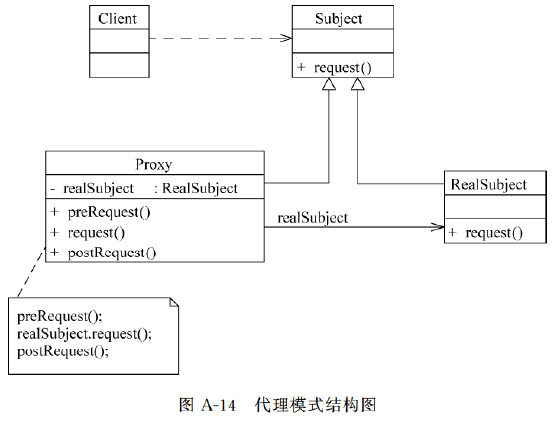
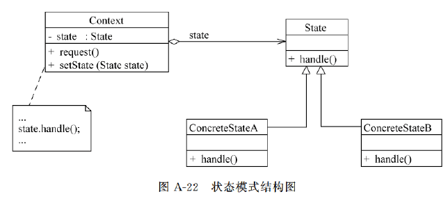

# 23种设计模式详解与示例代码


## 参考文章

[23种设计模式详解与示例代码（详解附DEMO）](https://blog.csdn.net/qq_42055933/article/details/132045046)


[掌握14种UML图，清晰图示](https://blog.csdn.net/qq_35423190/article/details/125069834)

[五分钟带你读懂UML类图](https://mp.weixin.qq.com/s?__biz=MzIxMjE3NjYwOQ==&mid=2247483673&idx=1&sn=d67d382bb5c35f0b8fc46f5c907cd289&chksm=960b1a8d92f7df570ba7c46fd7f9dfd4c0a37fa8b65252229fc938c804ed595db721413541e9&mpshare=1&scene=24&srcid=11263Driew2fRnd1rT6vijKT&sharer_shareinfo=73a20cde0e188cbdb8ec0d700c53982a&sharer_shareinfo_first=73a20cde0e188cbdb8ec0d700c53982a&ascene=14&devicetype=android-34&version=2800353f&nettype=WIFI&abtest_cookie=AAACAA%3D%3D&lang=zh_CN&countrycode=AU&exportkey=n_ChQIAhIQqEE0WbfxwytydUiAxACHOBL1AQIE97dBBAEAAAAAAJkBC6P3mzMAAAAOpnltbLcz9gKNyK89dVj0ANqUDLdvjm8DHlQNj6WGrWPm7mYxnLUly2ryXnujdLuBQS1RmS0yDBHKZDmXxJ9rqAy5HydZZEPB3nuz0KVK6z5Vn741Gr8lxF0TG7jiZkaAY0%2ByQ54kERxUXrTKzWJdu5HXBC3j%2BnZ2DmgoIzj93llizG7BmwYPr2t0A28A50HBmMTkxOpVzJLNCm0D2uEAYlROWjOXmY3MFQ4XyVO9rCFQ%2Fi%2BYcFIgdnKgJWPBp2zZrgu5HivB%2BzVhVpvf%2FNz%2BtszcJEe2KzSHOIlW2NOh&pass_ticket=PxAIpmPI1EG5fQiqmkDgcmbAquiXsazcadwb602lud%2BqPMEfBm8yVaEDdrBk%2BGXj&wx_header=3)

[如何零基础学会看 UML 类图？](https://www.zhihu.com/question/485992778/answer/2122648738?utm_psn=1844708751317282816)


## 目录

[0-简单工厂模式](#简单工厂模式)

### 1. 创建型模式

[1-工厂方法模式factory-pattern](#1-工厂方法模式factory-pattern)

[2-抽象工厂模式abstract-factory-pattern](#2-抽象工厂模式abstract-factory-pattern)

[3-单例模式singleton-pattern](#3-单例模式singleton-pattern)

[4-原型模式prototype-pattern](#4-原型模式prototype-pattern)

[5-建造者模式builder-pattern](#5-建造者模式builder-pattern)

### 2. 结构型模式

[6-适配器模式adapter-pattern](#6-适配器模式adapter-pattern)

[7-桥接模式bridge-pattern](#7-桥接模式bridge-pattern)

[8-组合模式composite-pattern](#8-组合模式composite-pattern)

[9-装饰器模式decorator-pattern](#9-装饰器模式decorator-pattern)

[10-外观模式facade-pattern](#10-外观模式facade-pattern)

[11-享元模式flyweight-pattern](#11-享元模式flyweight-pattern)

[12-代理模式proxy-pattern](#12-代理模式proxy-pattern)

### 3. 行为型模式

[13-模版方法模式template-method-pattern](#13-模版方法模式template-method-pattern)

[14-命令模式command-pattern](#14-命令模式command-pattern)

[15-迭代器模式iterator-pattern](#15-迭代器模式iterator-pattern)

[16-观察者模式observer-pattern](#16-观察者模式observer-pattern)

[17-中介者模式mediator-pattern](#17-中介者模式mediator-pattern)

[18-备忘录模式memento-pattern](#18-备忘录模式memento-pattern)

[19-解释器模式interpreter-pattern](#19-解释器模式interpreter-pattern)

[20-状态模式state-pattern](#20-状态模式state-pattern)

[21-策略模式strategy-pattern](#21-策略模式strategy-pattern)

[22-责任链模式职责链模式chain-of-responsibility-pattern](#22-责任链模式职责链模式chain-of-responsibility-pattern)

[23-访问者模式visitor-pattern](#23-访问者模式visitor-pattern)

## 摘要

本文将探讨设计模式在Java中的应用与实现。设计模式是一套被广泛接受的解决常见软件设计问题的经典方法。在Java编程中，设计模式是提高代码可读性、可维护性和可扩展性的关键。本文将详细介绍Java中常用的几种设计模式，包括工厂模式、单例模式、观察者模式和装饰器模式，并提供具体的代码示例和解释，帮助读者深入理解和学习这些模式的实现方式。


### 简单工厂模式


简单工厂模式（Simple Factory Pattern）是一种创建型设计模式，它通过定义一个工厂类来根据不同需求实例化对象。该模式将对象的创建过程封装在工厂类中，客户端只需提供所需的参数或类型，无需关心具体的对象如何创建。通过工厂方法，客户端能够获取所需的产品对象，而不需要直接调用构造函数或了解具体的类实现。


简单工厂模式的核心思想：通过工厂类来负责创建不同类型的对象。客户端不需要知道具体的类名，只需要通过工厂类来获取所需的对象实例。
- 定义统一的工厂类：工厂类负责创建具体的对象。
- 将实例化对象的过程封装在工厂中：客户端不需要知道具体产品的创建过程，只需要知道如何通过工厂方法获取产品对象。
- 避免直接在客户端代码中创建对象：客户端不直接依赖具体的类，而是通过工厂类获取对象。

#### 示例:Simple_Factory_Pattern

```java
package Simple_Factory_Pattern;

public class Test {
    public static void main(String[] args) {
        Factory.getProduct("A").show();
        Factory.getProduct("B").show();
    }
}


abstract class Product{
    public abstract void show();
}

class ProductA extends Product{
    @Override
    public void show() {
        System.out.println("Product A");
    }
}

class ProductB extends Product{
    @Override
    public void show() {
        System.out.println("Product B");
    }
}

class Factory{
    public static Product getProduct(String productName){
        Product product = null;
        switch (productName){
            case "A":
                product = new ProductA();
                break;
            case "B":
                product = new ProductB();
                break;
        }
        return product;
    }
}

```


------------------------


## 1.创建型模式

### 1. 工厂方法模式(Factory Pattern)


工厂模式是一种创建型设计模式，它提供了一种创建对象的最佳方式，而无需向客户端暴露创建逻辑。在Java中，工厂模式通常通过一个工厂类来实现对象的实例化，这样可以降低耦合性，使代码更加灵活。

#### 示例:Factory_Pattern/example002

```java
package 创建型模式.Factory_Pattern.example002;

public class Test {
    public static void main(String[] args) {
        ShapeFactory factory = new ShapeFactory();
        Shape circle = factory.createShape("circle");
        circle.draw(); // 输出：绘制圆形

        Shape rectangle = factory.createShape("rectangle");
        rectangle.draw(); // 输出：绘制矩形

    }
}

interface Shape {
    void draw();
}

class Circle implements Shape {
    @Override
    public void draw() {
        System.out.println("绘制圆形");
    }
}

class Rectangle implements Shape {
    @Override
    public void draw() {
        System.out.println("绘制矩形");
    }
}

class ShapeFactory {
    public Shape createShape(String shapeType) {
        if ("circle".equalsIgnoreCase(shapeType)) {
            return new Circle();
        } else if ("rectangle".equalsIgnoreCase(shapeType)) {
            return new Rectangle();
        }
        return null;
    }
}


```

---------------------------


#### 背景

在软件开发中，我们经常需要根据不同的需求创建不同类型的对象。一种常见的做法是直接在客户端代码中使用具体类来创建对象。但这样做会导致客户端代码与具体类紧密耦合，当需要更换或添加新的产品时，就必须修改客户端代码，不符合开闭原则。

#### 解决方案

工厂方法模式通过将对象的创建抽象成一个工厂接口，让具体的工厂子类实现该接口来创建不同种类的产品。客户端代码只需要通过工厂接口来创建产品对象，无需关心具体的实现类。

#### 应用场景

工厂方法模式适用于以下情况：

1.创建对象的逻辑比较复杂，不希望将该逻辑直接暴露在客户端代码中。
2.需要根据不同的条件来创建不同类型的对象。
3.希望通过工厂接口来创建对象，从而实现对象的多态性。


#### 示例:Factory_Pattern/example003


```java
package 创建型模式.Factory_Pattern.example003;

public class Client {
    public static void main(String[] args) {
        LoggerFactory fileLoggerFactory = new FileLoggerFactory();
        Logger fileLogger = fileLoggerFactory.createLogger();
        fileLogger.log("这是文件日志记录");

        LoggerFactory databaseLoggerFactory = new DatabaseLoggerFactory();
        Logger databaseLogger = databaseLoggerFactory.createLogger();
        databaseLogger.log("这是数据库日志记录");

    }
}

// 抽象日志记录器接口
interface Logger {
    void log(String message);
}


// 具体文件日志记录器
class FileLogger implements Logger {
    @Override
    public void log(String message) {
        System.out.println("记录日志到文件：" + message);
    }
}

// 具体数据库日志记录器
class DatabaseLogger implements Logger {
    @Override
    public void log(String message) {
        System.out.println("记录日志到数据库：" + message);
    }
}


// 抽象日志记录器工厂接口
interface LoggerFactory {
    Logger createLogger();
}


// 具体文件日志记录器工厂
class FileLoggerFactory implements LoggerFactory {
    @Override
    public Logger createLogger() {
        return new FileLogger();
    }
}

// 具体数据库日志记录器工厂
class DatabaseLoggerFactory implements LoggerFactory {
    @Override
    public Logger createLogger() {
        return new DatabaseLogger();
    }
}


```


在这个示例中，工厂方法模式允许我们通过 LoggerFactory 接口和具体工厂类 FileLoggerFactory 和 DatabaseLoggerFactory 来创建不同类型的日志记录器，而无需在客户端代码中直接实例化具体的日志记录器类。客户端只需要通过工厂接口来创建日志记录器对象，从而实现了对象的解耦和灵活性。

通过工厂方法模式，我们将对象的创建抽象成一个工厂接口，使得客户端代码与具体的产品类解耦，提高了代码的可维护性和可扩展性。


### 2. 抽象工厂模式(Abstract Factory Pattern)


抽象工厂模式是一种创建型设计模式，它提供了一种将一组相关或相互依赖的对象创建的接口，而无需指定其具体类的方式。抽象工厂模式通过将产品的创建抽象成一个工厂接口，让具体的工厂子类实现该接口来创建不同种类的产品。


#### 应用场景

当系统需要一组相互关联的对象，并希望统一创建这组对象时，抽象工厂模式非常适用。它允许客户端使用抽象的接口来创建一组相关的产品，从而实现松耦合，并且能够方便地更换不同的产品组合。

#### 示例:Abstract_Factory_Pattern/example001

```java
package 创建型模式.Abstract_Factory_Pattern.example001;

// 客户端代码
public class Client {
    public static void main(String[] args) {
        GUIFactory windowsFactory = new WindowsGUIFactory();
        Button windowsButton = windowsFactory.createButton();
        TextField windowsTextField = windowsFactory.createTextField();

        GUIFactory macFactory = new MacGUIFactory();
        Button macButton = macFactory.createButton();
        TextField macTextField = macFactory.createTextField();

        windowsButton.render(); // 输出：渲染Windows风格的按钮
        windowsTextField.display(); // 输出：显示Windows风格的文本框

        macButton.render(); // 输出：渲染Mac风格的按钮
        macTextField.display(); // 输出：显示Mac风格的文本框
    }
}

// 抽象按钮接口
interface Button {
    void render();
}

// 抽象文本框接口
interface TextField {
    void display();
}


// Windows 风格按钮实现
class WindowsButton implements Button {
    @Override
    public void render() {
        System.out.println("渲染Windows风格的按钮");
    }
}

// Windows 风格文本框实现
class WindowsTextField implements TextField {
    @Override
    public void display() {
        System.out.println("显示Windows风格的文本框");
    }
}

// Mac 风格按钮实现
class MacButton implements Button {
    @Override
    public void render() {
        System.out.println("渲染Mac风格的按钮");
    }
}

// Mac 风格文本框实现
class MacTextField implements TextField {
    @Override
    public void display() {
        System.out.println("显示Mac风格的文本框");
    }
}

// 抽象工厂接口
interface GUIFactory {
    Button createButton();
    TextField createTextField();
}

// Windows 风格工厂实现
class WindowsGUIFactory implements GUIFactory {
    @Override
    public Button createButton() {
        return new WindowsButton();
    }

    @Override
    public TextField createTextField() {
        return new WindowsTextField();
    }
}

// Mac 风格工厂实现
class MacGUIFactory implements GUIFactory {
    @Override
    public Button createButton() {
        return new MacButton();
    }

    @Override
    public TextField createTextField() {
        return new MacTextField();
    }
}


```

在这个示例中，抽象工厂模式允许我们通过使用抽象的GUIFactory接口来创建WindowsGUIFactory和MacGUIFactory这两个具体的工厂，分别用于创建Windows风格和Mac风格的按钮和文本框。客户端代码只需要与抽象工厂和抽象产品接口进行交互，无需关心具体的实现细节，从而实现了对象的解耦和灵活性。


###  3. 单例模式(Singleton Pattern)


单例模式是一种创建型设计模式，确保一个类只有一个实例，并提供全局访问点。在Java中，单例模式可以通过私有化构造方法和静态方法实现。


#### 示例:Singleton_pattern/example003

```java
package 创建型模式.Singleton_Pattern.example003;

public class Test {
    public static void main(String[] args) {
        Logger logger = Logger.getInstance();
        logger.log("这是一条日志信息");

    }
}

class Logger {
    private static Logger instance;

    private Logger() {
        // 私有构造方法
    }

    public static Logger getInstance() {
        if (instance == null) {
            instance = new Logger();
        }
        return instance;
    }

    public void log(String message) {
        System.out.println("日志记录：" + message);
    }
}


```

是一种创建型设计模式，它保证一个类只有一个实例，并提供一个全局访问点来获取这个唯一的实例。这种模式的目的是确保一个类在任何情况下都只有一个实例，并提供一种访问这个实例的方式，以便在整个应用程序中共享这个唯一的实例。

#### 背景
在某些情况下，我们需要确保某个类只有一个实例，比如配置对象、线程池、数据库连接等。如果多次创建实例可能会导致资源浪费、状态不一致等问题。

#### 解决方案

单例模式通过使用私有的构造函数和静态方法来控制对象的实例化，从而确保类只有一个实例，并且提供一个全局的访问点来获取这个唯一的实例。
#### 实现方式
单例模式有多种实现方式，其中最常见的是懒汉式和饿汉式。

`懒汉式`: 在第一次需要使用实例时才创建对象。在多线程环境下，可能会存在竞争条件，需要考虑线程安全问题。
`饿汉式`: 在类加载时就创建对象。由于在类加载时就创建了实例，因此不存在线程安全问题，但可能会在应用程序启动时造成资源浪费。


##### 1. 懒汉式示例:Singleton_Pattern/example001

```java
package 创建型模式.Singleton_Pattern.example001;

/**
 * 懒汉式
 */
public class Client {
    public static void main(String[] args) {
        Singleton singleton = Singleton.getInstance();
        singleton.doSomething();
    }
}


// 单例类
class Singleton {
    private static Singleton instance;

    // 私有构造函数，防止外部实例化
    private Singleton() {}

    // 全局访问点，获取唯一实例
    public static synchronized Singleton getInstance() {
        if (instance == null) {
            instance = new Singleton();
        }
        return instance;
    }

    // 其他实例方法
    public void doSomething() {
        System.out.println("hello world");
    }
}


```

##### 2. 饿汉式示例:Singleton_Pattern/example002

```java
package 创建型模式.Singleton_Pattern.example002;

/**
 * 饿汉式
 */
public class Client {
    public static void main(String[] args) {
        ESingleton esingleton = ESingleton.getInstance();
        esingleton.doSomething();
    }
}

// 单例类
class ESingleton {
    private static final ESingleton instance = new ESingleton();

    // 私有构造函数，防止外部实例化
    private ESingleton() {}

    // 全局访问点，获取唯一实例
    public static  ESingleton getInstance() {
        return instance;
    }


    // 其他实例方法
    public void doSomething() {
        System.out.println("hello world");
    }
}


```
通过单例模式，我们可以保证一个类只有一个实例，并在整个应用程序中共享这个唯一的实例，从而避免了多次创建实例的资源浪费和状态不一致的问题。


### 4. 原型模式(Prototype Pattern)


原型模式是一种创建型设计模式，它用于通过复制已有对象来创建新的对象，而无需使用显式的构造函数调用。原型模式允许我们在运行时动态地复制对象，而不是依赖于预定义的类构造函数。

#### 示例:创建型模式.Prototype_Pattern/example001

创建一个抽象类 Shape 表示图形对象，它具有一个抽象方法 clone 用于复制自身。然后创建具体子类 Circle 和 Rectangle，实现 clone 方法来复制自身。

```java
package 创建型模式.Prototype_Pattern.example001;

public class Test {
    public static void main(String[] args) throws CloneNotSupportedException {
        Shape circle = new Circle();
        Shape clonedCircle = (Shape) circle.clone();
        clonedCircle.draw(); // 输出：绘制圆形

        Shape rectangle = new Rectangle();
        Shape clonedRectangle = (Shape) rectangle.clone();
        clonedRectangle.draw(); // 输出：绘制矩形
    }
}

abstract class Shape implements Cloneable {
    protected String type;

    public abstract void draw();

    public String getType() {
        return type;
    }

    // clone 方法声明抛出 CloneNotSupportedException
    @Override
    public Object clone() throws CloneNotSupportedException {
        return super.clone();
    }
}

class Circle extends Shape {
    public Circle() {
        type = "Circle";
    }

    @Override
    public void draw() {
        System.out.println("绘制圆形");
    }
}

class Rectangle extends Shape {
    public Rectangle() {
        type = "Rectangle";
    }

    @Override
    public void draw() {
        System.out.println("绘制矩形");
    }
}


```

通过复制（克隆）一个已有对象来创建新的对象，而不是通过使用构造函数来创建。这种模式可以帮助我们避免重复创建对象的开销，提高性能，并且可以在运行时动态地添加或删除对象。

#### 背景

在某些情况下，创建一个对象的过程非常复杂或耗时，而且我们可能需要创建多个相似的对象。如果每次都使用构造函数来创建新对象，会产生很大的性能开销。此时，原型模式就可以帮助我们避免这种重复的创建过程。

#### 解决方案

原型模式的解决方案是将一个已有对象作为原型，通过复制这个原型来创建新的对象。这样，我们可以在原型的基础上进行微调和修改，得到一系列相似的对象

#### 实现方式
原型模式的关键是实现对象的克隆方法。Java中提供了Cloneable接口来支持对象的克隆，它是一个标记接口，表明对象可以被复制。

#### 示例:Prototype_Pattern/example002

```java
package 创建型模式.Prototype_Pattern.example002;

// 客户端代码
public class Client {
    public static void main(String[] args) {
        Shape rectangle1 = new Rectangle();
        Shape rectangle2 = rectangle1.cloneShape();

        Shape circle1 = new Circle();
        Shape circle2 = circle1.cloneShape();

        System.out.println(rectangle1.getType()); // 输出：Rectangle
        System.out.println(rectangle2.getType()); // 输出：Rectangle

        System.out.println(circle1.getType());    // 输出：Circle
        System.out.println(circle2.getType());    // 输出：Circle
    }
}

// 抽象图形类
abstract class Shape implements Cloneable {
    private String type;

    public Shape(String type) {
        this.type = type;
    }

    public String getType() {
        return type;
    }

    // 定义抽象的克隆方法
    public abstract Shape cloneShape();
}

// 具体矩形类
class Rectangle extends Shape {
    public Rectangle() {
        super("Rectangle");
    }

    @Override
    public Shape cloneShape() {
        try {
            return (Shape) super.clone();  // 使用super.clone()进行克隆
        } catch (CloneNotSupportedException e) {
            e.printStackTrace();
            return null;
        }
    }
}

// 具体圆形类
class Circle extends Shape {
    public Circle() {
        super("Circle");
    }

    @Override
    public Shape cloneShape() {
        try {
            return (Shape) super.clone();  // 使用super.clone()进行克隆
        } catch (CloneNotSupportedException e) {
            e.printStackTrace();
            return null;
        }
    }
}


```

在这个示例中，我们通过原型模式创建了矩形和圆形的多个实例。每个具体图形类都实现了克隆方法 cloneShape()，用于复制自身，从而创建新的对象。通过复制原型对象，我们可以得到相同类型的新对象，避免了重复创建的开销。

通过原型模式，我们可以在运行时动态地创建新对象，并且可以灵活地调整和修改这些对象，从而提高了代码的复用性和灵活性。


### 5. 建造者模式(Builder Pattern)


建造者模式是一种创建型设计模式，它将复杂对象的构建过程与其表示分离，从而使同样的构建过程可以创建不同的表示。

#### 示例:Builder_Pattern/example002

```java
package 创建型模式.Builder_Pattern.example002;

public class Test {
    public static void main(String[] args) {
        PizzaBuilder pizzaBuilder = new PizzaBuilder();
        Pizza pizza = pizzaBuilder.setSize("大")
                .addCheese()
                .addPepperoni()
                .addBacon()
                .build();

        System.out.println("您的披萨：大小-" + pizza.getSize() +
                "，奶酪-" + pizza.isCheese() +
                "，意式辣香肠-" + pizza.isPepperoni() +
                "，培根-" + pizza.isBacon());

    }
}

class Pizza {
    private String size;
    private boolean cheese;
    private boolean pepperoni;
    private boolean bacon;

    public Pizza(String size, boolean cheese, boolean pepperoni, boolean bacon) {
        this.size = size;
        this.cheese = cheese;
        this.pepperoni = pepperoni;
        this.bacon = bacon;
    }


    public String getSize() {
        return size;
    }

    public void setSize(String size) {
        this.size = size;
    }

    public boolean isCheese() {
        return cheese;
    }

    public void setCheese(boolean cheese) {
        this.cheese = cheese;
    }

    public boolean isPepperoni() {
        return pepperoni;
    }

    public void setPepperoni(boolean pepperoni) {
        this.pepperoni = pepperoni;
    }

    public boolean isBacon() {
        return bacon;
    }

    public void setBacon(boolean bacon) {
        this.bacon = bacon;
    }
}

class PizzaBuilder {
    private String size;
    private boolean cheese;
    private boolean pepperoni;
    private boolean bacon;

    public PizzaBuilder setSize(String size) {
        this.size = size;
        return this;
    }

    public PizzaBuilder addCheese() {
        this.cheese = true;
        return this;
    }

    public PizzaBuilder addPepperoni() {
        this.pepperoni = true;
        return this;
    }

    public PizzaBuilder addBacon() {
        this.bacon = true;
        return this;
    }

    public Pizza build() {
        return new Pizza(size, cheese, pepperoni, bacon);
    }
}


```

-------------------


#### 背景
在某些情况下，一个对象的构建过程非常复杂，涉及多个步骤，每个步骤都可能有多种选择。如果直接在客户端代码中进行对象的构建，会导致构建过程变得庞大而复杂，难以维护和扩展。

#### 解决方案
建造者模式通过将复杂对象的构建过程封装在一个独立的建造者类中，让客户端代码只需要与建造者进行交互，而不需要知道具体的构建细节。建造者类负责组装复杂对象的各个部分，并提供一种方法来返回最终构建好的对象。

#### 实现方式

建造者模式的关键是定义一个独立的建造者类，该类包含构建复杂对象所需的各个步骤，以及一个返回最终对象的方法。通常，建造者模式还涉及到一个指导者类，用于根据客户端的需求来选择不同的建造者来构建对象。

#### 示例:Builder_Pattern/example003

```java
package 创建型模式.Builder_Pattern.example003;

// 客户端代码
public class Client {
    public static void main(String[] args) {
        ComputerBuilder builder = new ComputerBuilder();

        builder.buildCpu("Intel i7");
        builder.buildMemory("16GB");
        builder.buildHardDisk("1TB");

        Computer computer = builder.getResult();
        System.out.println(computer.getConfiguration()); // 输出：CPU：Intel i7，内存：16GB，硬盘：1TB
    }
}


// 电脑类
class Computer {
    private String cpu;
    private String memory;
    private String hardDisk;

    public void setCpu(String cpu) {
        this.cpu = cpu;
    }

    public void setMemory(String memory) {
        this.memory = memory;
    }

    public void setHardDisk(String hardDisk) {
        this.hardDisk = hardDisk;
    }

    public String getConfiguration() {
        return "CPU：" + cpu + "，内存：" + memory + "，硬盘：" + hardDisk;
    }
}

// 电脑建造者类
class ComputerBuilder {
    private Computer computer = new Computer();

    public void buildCpu(String cpu) {
        computer.setCpu(cpu);
    }

    public void buildMemory(String memory) {
        computer.setMemory(memory);
    }

    public void buildHardDisk(String hardDisk) {
        computer.setHardDisk(hardDisk);
    }

    public Computer getResult() {
        return computer;
    }
}


```

在这个示例中，我们通过建造者模式逐步构建了电脑对象。客户端代码只需要与建造者类 ComputerBuilder 进行交互，无需知道具体的构建细节。通过不同的建造者，我们可以构建不同配置的电脑对象。

通过建造者模式，我们将复杂对象的构建过程与表示分离，使得构建过程更加灵活和可扩展，同时也提高了代码的可维护性和可读性。


## 2. 结构型模式

### 6. 适配器模式(Adapter Pattern)


适配器模式是一种结构型设计模式，它允许不兼容的接口之间进行协同工作。适配器模式通过创建适配器类来转换一个接口为客户端所期望的另一个接口。

#### 示例:Adapter_Pattern/example002

```java
package 结构型模式.Adapter_Pattern.example002;

public class Test {
    public static void main(String[] args) {
        LegacyRectangle legacyRectangle = new LegacyRectangle();
        Rectangle rectangleAdapter = new LegacyRectangleAdapter(legacyRectangle);
        double area = rectangleAdapter.getArea();
        System.out.println("矩形的面积：" + area);

    }
}


class LegacyRectangle {
    public double calculateArea() {
        // 计算矩形面积的复杂逻辑
        return 0.0;
    }
}

interface Rectangle {
    double getArea();
}

class LegacyRectangleAdapter implements Rectangle {
    private LegacyRectangle legacyRectangle;

    public LegacyRectangleAdapter(LegacyRectangle legacyRectangle) {
        this.legacyRectangle = legacyRectangle;
    }

    @Override
    public double getArea() {
        return legacyRectangle.calculateArea();
    }
}


```

-----------------------

它允许将一个类的接口转换成客户端所期望的另一个接口。适配器模式可以帮助原本不兼容的类能够一起工作，使得系统中的现有类能够与第三方组件或新接口进行协同工作。

#### 背景
在现实世界中，我们常常遇到需要将两个不兼容的东西连接在一起的情况。类似地，当我们使用一个现有的类库或组件，但它的接口与我们的代码不匹配时，就需要使用适配器模式来进行适配。

#### 解决方案
适配器模式通过引入一个适配器类，将现有的类与客户端的接口进行适配。适配器类包含了客户端所期望的接口，并持有一个现有类的实例，将客户端的请求转换为现有类的方法调用。

#### 实现方式
适配器模式可以分为两种实现方式：类适配器和对象适配器。

##### 类适配器


通过多重继承，让适配器类同时继承目标接口和现有类，从而实现接口的适配。但在Java等语言中，由于不支持多重继承，类适配器的实现较为复杂，通常不常用。

##### 对象适配器


通过组合，让适配器类持有现有类的实例，并实现目标接口。对象适配器使用组合关系来实现接口的适配，较为常用。


#### 示例:Adapter_Pattern/example003

```java
package 结构型模式.Adapter_Pattern.example003;

// 客户端代码
public class Client {
    public static void main(String[] args) {
        MediaPlayer mediaPlayer = new AudioPlayer();
        mediaPlayer.playAudio("song.mp3");

        AdvancedMediaPlayer flacPlayer = new FlacPlayer();
        MediaPlayer mediaAdapter = new MediaAdapter(flacPlayer);
        mediaAdapter.playAudio("song.flac");
    }
}

// 播放器接口
interface MediaPlayer {
    void playAudio(String fileName);
    void playVideo(String fileName);
}

// 新的音频播放器接口
interface AdvancedMediaPlayer {
    void playMp3(String fileName);
    void playFlac(String fileName);
}

// 现有的播放器类
class AudioPlayer implements MediaPlayer {
    @Override
    public void playAudio(String fileName) {
        // 模拟播放MP3音频
        System.out.println("Playing MP3 file: " + fileName);
    }

    @Override
    public void playVideo(String fileName) {
        // 空实现，不支持视频播放
    }
}

// 新的音频播放器实现类
class FlacPlayer implements AdvancedMediaPlayer {
    @Override
    public void playMp3(String fileName) {
        // 空实现，不支持MP3格式
    }

    @Override
    public void playFlac(String fileName) {
        // 模拟播放FLAC音频
        System.out.println("Playing FLAC file: " + fileName);
    }
}


// 适配器类
class MediaAdapter implements MediaPlayer {
    private AdvancedMediaPlayer advancedMediaPlayer;

    public MediaAdapter(AdvancedMediaPlayer advancedMediaPlayer) {
        this.advancedMediaPlayer = advancedMediaPlayer;
    }

    @Override
    public void playAudio(String fileName) {
        // 将请求适配为FLAC格式播放
        advancedMediaPlayer.playFlac(fileName);
    }

    @Override
    public void playVideo(String fileName) {
        // 空实现，不支持视频播放
    }
}


```

这段代码通过适配器模式实现了将现有的 `AudioPlayer` 类扩展为支持播放 `FLAC` 格式的文件。

让我们详细看看代码的工作原理：

### 问题背景
在代码中，`AudioPlayer` 类只支持播放 `MP3` 格式的文件，但是需求中可能需要播放 `FLAC` 格式的音频文件。由于 `AudioPlayer` 类并没有提供播放 `FLAC` 文件的能力，适配器模式应运而生，它能够通过“适配器”将不兼容的接口或类转换为兼容的接口或类，使得 `AudioPlayer` 能够播放 `FLAC` 文件。

### 代码分析

1. **播放器接口 (`MediaPlayer`)**  
   定义了 `playAudio` 和 `playVideo` 两个方法，其中 `playAudio` 用来播放音频文件，`playVideo` 用来播放视频文件。
    - `AudioPlayer` 实现了 `MediaPlayer` 接口，能够播放 MP3 格式的音频。

2. **高级播放器接口 (`AdvancedMediaPlayer`)**  
   定义了 `playMp3` 和 `playFlac` 两个方法。
    - `FlacPlayer` 实现了 `AdvancedMediaPlayer` 接口，能够播放 FLAC 格式的音频。
    - 但是，`AudioPlayer` 类并没有实现 `AdvancedMediaPlayer`，因此它无法直接播放 `FLAC` 格式的音频。

3. **适配器类 (`MediaAdapter`)**  
   `MediaAdapter` 类是核心，它实现了 `MediaPlayer` 接口，并通过组合（持有一个 `AdvancedMediaPlayer` 的实例）来适配不兼容的接口。
    - 在 `MediaAdapter` 的 `playAudio` 方法中，调用了 `advancedMediaPlayer.playFlac()` 来实现播放 `FLAC` 格式的音频，从而达到了适配的效果。

### 客户端代码执行
- 首先，创建了一个 `AudioPlayer` 实例，并通过它播放了 MP3 格式的文件。
- 然后，创建了一个 `FlacPlayer` 实例，并将其包装在 `MediaAdapter` 中，从而使得 `AudioPlayer` 能够通过适配器播放 `FLAC` 格式的音频。

### 适配器模式的关键作用：
- 通过 `MediaAdapter` 类，`AudioPlayer` 虽然不能直接播放 `FLAC` 格式，但通过适配器将请求传递给 `FlacPlayer`，从而实现了播放 `FLAC` 文件的功能。
- 适配器模式的作用就是将一个类的接口转换成客户端期望的另一个接口，使得原本不兼容的类可以一起工作。

### 总结：
通过适配器模式，`AudioPlayer` 类通过 `MediaAdapter` 能够播放 `FLAC` 格式的音频文件，而不需要修改原有的 `AudioPlayer` 类。这正是适配器模式的典型应用：它允许不同接口的类在不修改它们的前提下进行互操作。


### 7. 桥接模式(Bridge Pattern)

桥接模式是一种结构型设计模式，它将抽象部分与实现部分分离，允许它们可以独立地变化。桥接模式通过组合多个对象来完成更复杂的功能，而不是继承单个类。

#### 示例:Bridge_Pattern/example001


创建一个抽象类 Shape 和一个实现类 Color，然后创建具体子类 Circle 和 Square 来继承 Shape，并创建子类 RedColor 和 GreenColor 来继承 Color。然后使用桥接模式将 Shape 和 Color 组合。

```java
package 结构型模式.Bridge_Pattern.example001;

public class Test {
    public static void main(String[] args) {
        Color redColor = new RedColor();
        Color greenColor = new GreenColor();

        Shape redCircle = new Circle(redColor);
        Shape greenSquare = new Square(greenColor);

        redCircle.applyColor(); // 输出：圆形 应用红色
        greenSquare.applyColor(); // 输出：矩形 应用绿色

    }
}


interface Color {
    void applyColor();
}

class RedColor implements Color {
    @Override
    public void applyColor() {
        System.out.println("应用红色");
    }
}

class GreenColor implements Color {
    @Override
    public void applyColor() {
        System.out.println("应用绿色");
    }
}

abstract class Shape {
    protected Color color;

    public Shape(Color color) {
        this.color = color;
    }

    public abstract void applyColor();
}

class Circle extends Shape {
    public Circle(Color color) {
        super(color);
    }

    @Override
    public void applyColor() {
        System.out.print("圆形 ");
        color.applyColor();
    }
}

class Square extends Shape {
    public Square(Color color) {
        super(color);
    }

    @Override
    public void applyColor() {
        System.out.print("矩形 ");
        color.applyColor();
    }
}

```

-------------------------

它将抽象部分与实现部分分离，使得它们可以独立地变化。桥接模式的目的是将继承关系转化为关联关系，从而减少类之间的耦合，提高系统的灵活性。

#### 背景
在软件开发中，我们常常遇到多层次的继承结构。例如，有一个抽象类 Shape 表示各种形状，然后派生出具体的形状类 Circle、Rectangle 等。接着，又有另一个维度的变化，比如颜色。我们可能想在 Circle 和 Rectangle 类中加入颜色属性，但这样会导致类的爆炸式增长。

#### 解决方案

桥接模式通过将抽象部分和实现部分分离，建立一个桥接（Bridge）来连接它们。抽象部分拥有一个指向实现部分的引用，从而使得两者可以独立地变化。这样，我们可以通过组合关系来避免继承的复杂性，而将变化的维度从继承结构中解耦出来。

#### 实现方式
桥接模式的关键是将抽象部分和实现部分分离，并通过组合关系将它们连接在一起。在实现桥接模式时，通常会定义一个抽象部分的接口和实现部分的接口，然后创建具体的实现类来实现这些接口。


#### 示例:Bridge_Pattern/example002

```java
package 结构型模式.Bridge_Pattern.example002;

// 客户端代码
public class Client {
    public static void main(String[] args) {
        DrawingAPI drawingAPI1 = new DrawingAPI1();
        DrawingAPI drawingAPI2 = new DrawingAPI2();

        Shape circle1 = new Circle(100, 100, 50, drawingAPI1);
        Shape circle2 = new Circle(200, 200, 100, drawingAPI2);

        Shape rectangle1 = new Rectangle(10, 20, 30, 40, drawingAPI1);
        Shape rectangle2 = new Rectangle(50, 60, 70, 80, drawingAPI2);

        circle1.draw();     // 输出：API1 Drawing Circle at (100,100) with radius 50
        circle2.draw();     // 输出：API2 Drawing Circle at (200,200) with radius 100
        rectangle1.draw();  // 输出：API1 Drawing Rectangle from (10,20) to (30,40)
        rectangle2.draw();  // 输出：API2 Drawing Rectangle from (50,60) to (70,80)
    }
}


// 抽象形状类
abstract class Shape {
    protected DrawingAPI drawingAPI;

    public Shape(DrawingAPI drawingAPI) {
        this.drawingAPI = drawingAPI;
    }

    public abstract void draw();
}


// 抽象绘图API
interface DrawingAPI {
    void drawCircle(int x, int y, int radius);
    void drawRectangle(int x1, int y1, int x2, int y2);
}


// 具体圆形类
class Circle extends Shape {
    private int x, y, radius;

    public Circle(int x, int y, int radius, DrawingAPI drawingAPI) {
        super(drawingAPI);
        this.x = x;
        this.y = y;
        this.radius = radius;
    }

    @Override
    public void draw() {
        drawingAPI.drawCircle(x, y, radius);
    }
}

// 具体矩形类
class Rectangle extends Shape {
    private int x1, y1, x2, y2;

    public Rectangle(int x1, int y1, int x2, int y2, DrawingAPI drawingAPI) {
        super(drawingAPI);
        this.x1 = x1;
        this.y1 = y1;
        this.x2 = x2;
        this.y2 = y2;
    }

    @Override
    public void draw() {
        drawingAPI.drawRectangle(x1, y1, x2, y2);
    }
}


// 具体绘图API实现类1
class DrawingAPI1 implements DrawingAPI {
    @Override
    public void drawCircle(int x, int y, int radius) {
        System.out.println("API1 Drawing Circle at (" + x + "," + y + ") with radius " + radius);
    }

    @Override
    public void drawRectangle(int x1, int y1, int x2, int y2) {
        System.out.println("API1 Drawing Rectangle from (" + x1 + "," + y1 + ") to (" + x2 + "," + y2 + ")");
    }
}

// 具体绘图API实现类2
class DrawingAPI2 implements DrawingAPI {
    @Override
    public void drawCircle(int x, int y, int radius) {
        System.out.println("API2 Drawing Circle at (" + x + "," + y + ") with radius " + radius);
    }

    @Override
    public void drawRectangle(int x1, int y1, int x2, int y2) {
        System.out.println("API2 Drawing Rectangle from (" + x1 + "," + y1 + ") to (" + x2 + "," + y2 + ")");
    }
}


```

在这个示例中，桥接模式允许我们将 Shape 和 DrawingAPI 进行独立变化，使得我们可以在不修改 Shape 类的情况下，将不同的 DrawingAPI 实现注入到不同的形状中，从而实现了形状与绘图API之间的解耦合。通过桥接模式，我们可以有效地扩展和组合类的功能，提高系统的灵活性和可维护性。


### 8. 组合模式(Composite Pattern)


组合模式是一种结构型设计模式，它允许我们将对象组合成树形结构以表示“部分-整体”的层次结构。组合模式使得客户端可以统一对待单个对象和组合对象，从而简化了客户端的代码。

#### 示例:Composite_Pattern/example002

创建一个抽象类 Component 表示组件对象，它可以是叶子节点或组合节点。然后创建其具体子类 Leaf 和 Composite，分别表示叶子节点和组合节点。

```java
package 结构型模式.Composite_Pattern.example002;

import java.util.ArrayList;
import java.util.List;

public class Test {
    public static void main(String[] args) {
        Component root = new Composite("Root");

        Component node1 = new Composite("Node1");
        node1.add(new Leaf("Leaf1"));
        node1.add(new Leaf("Leaf2"));

        Component node2 = new Composite("Node2");
        node2.add(new Leaf("Leaf3"));

        root.add(node1);
        root.add(node2);

        root.display();
        // 输出：
        // Root
        // Node1
        // Leaf1
        // Leaf2
        // Node2
        // Leaf3

    }
}


abstract class Component {
    protected String name;

    public Component(String name) {
        this.name = name;
    }

    public abstract void add(Component component);
    public abstract void remove(Component component);
    public abstract void display();
}

class Leaf extends Component {
    public Leaf(String name) {
        super(name);
    }

    @Override
    public void add(Component component) {
        throw new UnsupportedOperationException("Leaf cannot add component.");
    }

    @Override
    public void remove(Component component) {
        throw new UnsupportedOperationException("Leaf cannot remove component.");
    }

    @Override
    public void display() {
        System.out.println(name);
    }
}

class Composite extends Component {
    private List<Component> components = new ArrayList<>();

    public Composite(String name) {
        super(name);
    }

    @Override
    public void add(Component component) {
        components.add(component);
    }

    @Override
    public void remove(Component component) {
        components.remove(component);
    }

    @Override
    public void display() {
        System.out.println(name);
        for (Component component : components) {
            component.display();
        }
    }
}


```

------------------------

它允许我们将对象组合成树状结构来表示整体-部分的层次结构。组合模式使得客户端可以统一地处理单个对象和组合对象，从而使得代码更加简洁和灵活。

#### 背景
在现实世界中，我们常常遇到整体和部分的层次结构。比如，公司由多个部门组成，每个部门可能又包含多个员工。在软件开发中，也经常遇到类似的层次结构，比如树形结构、目录结构等。

#### 解决方案
组合模式通过将对象组合成树状结构来表示整体-部分的层次结构。它将叶子节点（单个对象）和组合节点（包含子节点的对象）统一看待，从而使得客户端可以统一地处理单个对象和组合对象，而不必关心它们之间的差异。

#### 实现方式

组合模式的核心是定义一个组件接口，其中包含了组合对象和叶子对象的共同操作。然后，创建叶子节点类和组合节点类，它们都实现了组件接口。组合节点类中通常包含了一个子组件列表，用于存储它的子节点。

#### 示例:Composite_Pattern/example003

```java
package 结构型模式.Composite_Pattern.example003;

import java.util.ArrayList;
import java.util.List;

// 客户端代码
public class Client {
    public static void main(String[] args) {
        FileSystemComponent file1 = new File("file1.txt");
        FileSystemComponent file2 = new File("file2.txt");
        FileSystemComponent file3 = new File("file3.txt");

        FileSystemComponent subDirectory1 = new Directory("Sub Directory 1");
        subDirectory1.addComponent(file1);
        subDirectory1.addComponent(file2);

        FileSystemComponent subDirectory2 = new Directory("Sub Directory 2");
        subDirectory2.addComponent(file3);

        FileSystemComponent rootDirectory = new Directory("Root Directory");
        rootDirectory.addComponent(subDirectory1);
        rootDirectory.addComponent(subDirectory2);

        rootDirectory.display();
    }
}


interface FileSystemComponent {
    void display();
    void addComponent(FileSystemComponent component); // 声明方法
}

class File implements FileSystemComponent {
    private String name;

    public File(String name) {
        this.name = name;
    }

    @Override
    public void display() {
        System.out.println("File: " + name);
    }

    @Override
    public void addComponent(FileSystemComponent component) {
        throw new UnsupportedOperationException("Cannot add component to a file");
    }
}

class Directory implements FileSystemComponent {
    private String name;
    private List<FileSystemComponent> components;

    public Directory(String name) {
        this.name = name;
        this.components = new ArrayList<>();
    }

    @Override
    public void addComponent(FileSystemComponent component) {
        components.add(component);
    }

    @Override
    public void display() {
        System.out.println("Directory: " + name);
        for (FileSystemComponent component : components) {
            component.display();
        }
    }
}


```

在这个示例中，我们使用组合模式构建了一个文件系统的层次结构。File 类表示文件节点，Directory 类表示目录节点。目录节点中可以包含其他文件和目录节点，从而形成了树形结构。通过组合模式，我们可以统一地处理单个文件和整个文件系统，使得代码更加简洁和灵活。


### 9. 装饰器模式(Decorator Pattern)


装饰器模式是一种结构型设计模式，它允许在运行时动态地扩展对象的功能。装饰器模式通过创建包装类来实现功能的增强，而不是修改原始类。

#### 示例:Decorator_Pattern/example002

创建一个接口 Coffee 和其具体实现类 SimpleCoffee，然后通过装饰器模式添加额外的装饰功能。

```java
package 结构型模式.Decorator_Pattern.example002;

public class Test {
    public static void main(String[] args) {
        Coffee simpleCoffee = new SimpleCoffee();
        System.out.println("原味咖啡：" + simpleCoffee.getDescription() + "，价格：" + simpleCoffee.getCost() + "元");

        Coffee milkCoffee = new MilkDecorator(simpleCoffee);
        System.out.println("加牛奶咖啡：" + milkCoffee.getDescription() + "，价格：" + milkCoffee.getCost() + "元");

    }
}

interface Coffee {
    double getCost();
    String getDescription();
}

class SimpleCoffee implements Coffee {
    @Override
    public double getCost() {
        return 5.0;
    }

    @Override
    public String getDescription() {
        return "普通咖啡";
    }
}

abstract class CoffeeDecorator implements Coffee {
    protected Coffee decoratedCoffee;

    public CoffeeDecorator(Coffee coffee) {
        this.decoratedCoffee = coffee;
    }

    @Override
    public double getCost() {
        return decoratedCoffee.getCost();
    }

    @Override
    public String getDescription() {
        return decoratedCoffee.getDescription();
    }
}

class MilkDecorator extends CoffeeDecorator {
    public MilkDecorator(Coffee coffee) {
        super(coffee);
    }

    @Override
    public double getCost() {
        return super.getCost() + 2.0;
    }

    @Override
    public String getDescription() {
        return super.getDescription() + "，加牛奶";
    }
}


```

以上便是设计模式在Java中的应用与实现的介绍。设计模式是编写优雅、高效、易维护代码的重要工具，希望本文能帮助读者更好地理解和应用这些模式，从而提升自己的Java编程技能。


-----------------------------


它允许在不改变现有对象结构的情况下，动态地向对象添加新的功能。装饰器模式通过创建一个装饰器类，该类实现了与原始对象相同的接口，并持有一个原始对象的引用。通过将原始对象传递给装饰器，我们可以在运行时动态地为原始对象添加新的行为。

#### 背景

在软件开发中，我们经常遇到需要对现有对象进行功能扩展或修改的情况。但是，直接修改现有对象的代码可能会导致代码的不稳定和难以维护。此时，装饰器模式可以帮助我们以一种灵活的方式来扩展对象的功能，而不必修改原始对象的代码。

#### 解决方案

装饰器模式的解决方案是创建一个装饰器类，该类实现了与原始对象相同的接口，并持有一个原始对象的引用。装饰器类中可以包含新的功能，也可以在调用原始对象的方法前后加入额外的行为。通过将原始对象传递给装饰器，我们可以在运行时动态地为原始对象添加新的功能。

#### 实现方式

装饰器模式的核心是创建装饰器类，该类实现了与原始对象相同的接口，并持有一个原始对象的引用。在装饰器类中，可以添加新的功能或者调用原始对象的方法，并在调用前后加入额外的行为。通过组合多个装饰器，我们可以为对象添加多个不同的功能。

#### 示例:Decorator_Pattern/example003

假设我们有一个咖啡店，其中提供了基本的咖啡种类，比如浓缩咖啡和拿铁咖啡。我们希望能够在这些咖啡的基础上，动态地添加额外的配料，比如牛奶、糖浆等。

```java
package 结构型模式.Decorator_Pattern.example003;

// 客户端代码
public class Client {
    public static void main(String[] args) {
        Coffee espresso = new Espresso();
        System.out.println(espresso.getDescription() + " - Cost: $" + espresso.getCost());

        Coffee latteWithMilk = new MilkDecorator(new Latte());
        System.out.println(latteWithMilk.getDescription() + " - Cost: $" + latteWithMilk.getCost());

        Coffee latteWithMilkAndSyrup = new SyrupDecorator(new MilkDecorator(new Latte()));
        System.out.println(latteWithMilkAndSyrup.getDescription() + " - Cost: $" + latteWithMilkAndSyrup.getCost());
    }
}

// 咖啡接口
interface Coffee {
    String getDescription();
    double getCost();
}

// 浓缩咖啡类
class Espresso implements Coffee {
    @Override
    public String getDescription() {
        return "Espresso";
    }

    @Override
    public double getCost() {
        return 2.0;
    }
}

// 拿铁咖啡类
class Latte implements Coffee {
    @Override
    public String getDescription() {
        return "Latte";
    }

    @Override
    public double getCost() {
        return 3.0;
    }
}

// 咖啡装饰器类
abstract class CoffeeDecorator implements Coffee {
    protected Coffee decoratedCoffee;

    public CoffeeDecorator(Coffee decoratedCoffee) {
        this.decoratedCoffee = decoratedCoffee;
    }
}

// 牛奶装饰器类
class MilkDecorator extends CoffeeDecorator {
    public MilkDecorator(Coffee decoratedCoffee) {
        super(decoratedCoffee);
    }

    @Override
    public String getDescription() {
        return decoratedCoffee.getDescription() + ", Milk";
    }

    @Override
    public double getCost() {
        return decoratedCoffee.getCost() + 1.0;
    }
}

// 糖浆装饰器类
class SyrupDecorator extends CoffeeDecorator {
    public SyrupDecorator(Coffee decoratedCoffee) {
        super(decoratedCoffee);
    }

    @Override
    public String getDescription() {
        return decoratedCoffee.getDescription() + ", Syrup";
    }

    @Override
    public double getCost() {
        return decoratedCoffee.getCost() + 0.5;
    }
}


```

在这个示例中，我们使用装饰器模式为咖啡对象动态地添加了牛奶和糖浆等配料，而不需要修改咖啡类的代码。通过装饰器模式，我们可以在运行时动态地为对象添加新的功能，使得代码更加灵活和可扩展。

### 10. 外观模式(Facade Pattern)


外观模式是一种结构型设计模式，它提供了一个简化的接口，用于访问复杂系统中的一组接口。外观模式将复杂系统的功能封装起来，让客户端可以更方便地使用系统功能而不需要了解其内部复杂结构。

#### 示例:Facade_Pattern/example002

创建一个外观类 ComputerFacade，它封装了计算机系统的一组复杂接口，包括 CPU、内存和硬盘的启动和关闭操作。

```java
package 结构型模式.Facade_Pattern.example002;

public class Test {
    public static void main(String[] args) {
        ComputerFacade computerFacade = new ComputerFacade();
        computerFacade.start();
        // 输出：
        // 计算机启动开始
        // CPU 启动
        // 内存启动
        // 硬盘启动
        // 计算机启动完成

        computerFacade.shutdown();
        // 输出：
        // 计算机关闭开始
        // CPU 关闭
        // 内存关闭
        // 硬盘关闭
        // 计算机关闭完成

    }
}


class CPU {
    public void start() {
        System.out.println("CPU 启动");
    }

    public void shutdown() {
        System.out.println("CPU 关闭");
    }
}

class Memory {
    public void start() {
        System.out.println("内存启动");
    }

    public void shutdown() {
        System.out.println("内存关闭");
    }
}

class HardDrive {
    public void start() {
        System.out.println("硬盘启动");
    }

    public void shutdown() {
        System.out.println("硬盘关闭");
    }
}

class ComputerFacade {
    private CPU cpu;
    private Memory memory;
    private HardDrive hardDrive;

    public ComputerFacade() {
        cpu = new CPU();
        memory = new Memory();
        hardDrive = new HardDrive();
    }

    public void start() {
        System.out.println("计算机启动开始");
        cpu.start();
        memory.start();
        hardDrive.start();
        System.out.println("计算机启动完成");
    }

    public void shutdown() {
        System.out.println("计算机关闭开始");
        cpu.shutdown();
        memory.shutdown();
        hardDrive.shutdown();
        System.out.println("计算机关闭完成");
    }
}


```


---------------------------


它为复杂的子系统提供一个简单的接口，从而隐藏子系统的复杂性，使得客户端可以更方便地使用子系统。

#### 背景

在现实世界中，有些系统可能由多个复杂的子系统组成，每个子系统可能包含多个类和方法。当我们需要使用这些子系统时，直接调用子系统的方法会使客户端代码变得冗长和复杂。

#### 解决方案

外观模式的解决方案是创建一个外观类，该类为子系统提供了一个简单的接口，封装了子系统的复杂性。客户端只需要与外观类进行交互，而不需要直接与子系统的类和方法打交道。

#### 实现方式

外观模式的核心是定义一个外观类，该类为子系统提供了一个简单的接口。外观类中通常包含子系统的实例，并将客户端的请求转发给子系统进行处理。

#### 示例:Decorator_Pattern/example003

假设我们有一个计算机类 Computer，它由多个子系统组成，包括CPU、内存和硬盘等组件。现在，我们希望为计算机类提供一个简单的接口，使得客户端可以方便地开机和关机。

```java
package 结构型模式.Facade_Pattern.example003;

// 客户端代码
public class Client {
    public static void main(String[] args) {
        ComputerFacade computerFacade = new ComputerFacade();
        computerFacade.startComputer();
        System.out.println("-------------------");
        computerFacade.shutdownComputer();
    }
}


// 计算机类
class Computer {
    private CPU cpu;
    private Memory memory;
    private HardDisk hardDisk;

    public Computer() {
        this.cpu = new CPU();
        this.memory = new Memory();
        this.hardDisk = new HardDisk();
    }

    public void start() {
        cpu.start();
        memory.start();
        hardDisk.start();
        System.out.println("Computer started.");
    }

    public void shutdown() {
        hardDisk.shutdown();
        memory.shutdown();
        cpu.shutdown();
        System.out.println("Computer shutdown.");
    }
}


// CPU子系统类
class CPU {
    public void start() {
        System.out.println("CPU started.");
    }

    public void shutdown() {
        System.out.println("CPU shutdown.");
    }
}

// 内存子系统类
class Memory {
    public void start() {
        System.out.println("Memory started.");
    }

    public void shutdown() {
        System.out.println("Memory shutdown.");
    }
}

// 硬盘子系统类
class HardDisk {
    public void start() {
        System.out.println("HardDisk started.");
    }

    public void shutdown() {
        System.out.println("HardDisk shutdown.");
    }
}


// 外观类
class ComputerFacade {
    private Computer computer;

    public ComputerFacade() {
        this.computer = new Computer();
    }

    public void startComputer() {
        computer.start();
    }

    public void shutdownComputer() {
        computer.shutdown();
    }
}


```

在这个示例中，外观模式允许我们使用 ComputerFacade 类来方便地开机和关机，而不需要了解底层子系统的复杂性。通过外观模式，我们将子系统的复杂性封装在一个简单的接口之后，使得客户端代码更加清晰和易于维护。


### 11. 享元模式(Flyweight Pattern)


享元模式是一种结构型设计模式，它通过共享对象来最大化地减少内存使用和对象创建的数量。享元模式通过使用相同或相似的对象实例来代表一组对象，从而降低了系统的内存占用和运行开销。

#### 示例:Flyweight_Pattern/example002

创建一个 Player 接口和具体实现类 Terrorist 和 CounterTerrorist，用于表示游戏中的玩家。然后，创建一个工厂类 PlayerFactory 来管理玩家对象的共享。

```java
package 结构型模式.Flyweight_Pattern.example002;

import java.util.HashMap;
import java.util.Map;

public class Test {
    public static void main(String[] args) {
        Player terrorist1 = PlayerFactory.getPlayer("Terrorist");
        Player terrorist2 = PlayerFactory.getPlayer("Terrorist");
        Player counterTerrorist1 = PlayerFactory.getPlayer("CounterTerrorist");
        Player counterTerrorist2 = PlayerFactory.getPlayer("CounterTerrorist");

        terrorist1.assignWeapon("AK-47");
        terrorist1.mission(); // 输出：Terrorist with weapon AK-47 | Performing mission...

        terrorist2.assignWeapon("Desert Eagle");
        terrorist2.mission(); // 输出：Terrorist with weapon Desert Eagle | Performing mission...

        counterTerrorist1.assignWeapon("M4A1");
        counterTerrorist1.mission(); // 输出：CounterTerrorist with weapon M4A1 | Performing mission...

        counterTerrorist2.assignWeapon("USP");
        counterTerrorist2.mission(); // 输出：CounterTerrorist with weapon USP | Performing mission...

    }
}

interface Player {
    void assignWeapon(String weapon);
    void mission();
}

class Terrorist implements Player {
    private final String TASK;

    private String weapon;

    public Terrorist() {
        TASK = "Terrorist";
    }

    @Override
    public void assignWeapon(String weapon) {
        this.weapon = weapon;
    }

    @Override
    public void mission() {
        System.out.println(TASK + " with weapon " + weapon + " | Performing mission...");
    }
}

class CounterTerrorist implements Player {
    private final String TASK;

    private String weapon;

    public CounterTerrorist() {
        TASK = "CounterTerrorist";
    }

    @Override
    public void assignWeapon(String weapon) {
        this.weapon = weapon;
    }

    @Override
    public void mission() {
        System.out.println(TASK + " with weapon " + weapon + " | Performing mission...");
    }
}

class PlayerFactory {
    private static Map<String, Player> players = new HashMap<>();

    public static Player getPlayer(String task) {
        Player player = players.get(task);

        if (player == null) {
            switch (task) {
                case "Terrorist":
                    System.out.println("Creating a Terrorist player");
                    player = new Terrorist();
                    break;
                case "CounterTerrorist":
                    System.out.println("Creating a CounterTerrorist player");
                    player = new CounterTerrorist();
                    break;
                default:
                    throw new IllegalArgumentException("Invalid task: " + task);
            }
            players.put(task, player);
        }

        return player;
    }
}


```

这段代码实现的是**享元模式**（Flyweight Pattern），是一种结构型设计模式，旨在通过共享相似的对象来减少内存消耗。享元模式特别适用于有大量对象实例并且它们的状态可能是共享的场景。下面我会详细解释为什么这段代码是享元模式的实现，并且一步步解析其关键部分。

### 1. **享元模式的核心思想**
享元模式的核心思想是：
- 将多个相似的对象实例进行共享，而不是每次创建新的对象实例。
- 共享的对象称为“享元”，它们有两个部分：
    - **内部状态（Intrinsic State）**：是对象共享的部分，通常是不可变的。
    - **外部状态（Extrinsic State）**：是对象特有的部分，可以根据需要改变，通常由客户端传递。

通过共享相同的对象实例，享元模式能够显著减少内存占用，特别是当应用程序需要大量相似对象时。

### 2. **代码分析**
让我们逐步分析代码中的几个关键点，为什么它符合享元模式的定义。

#### **共享对象**
```java
Player terrorist1 = PlayerFactory.getPlayer("Terrorist");
Player terrorist2 = PlayerFactory.getPlayer("Terrorist");
Player counterTerrorist1 = PlayerFactory.getPlayer("CounterTerrorist");
Player counterTerrorist2 = PlayerFactory.getPlayer("CounterTerrorist");
```
在这部分代码中，我们通过 `PlayerFactory.getPlayer()` 方法获取了玩家对象。当调用 `PlayerFactory.getPlayer("Terrorist")` 和 `PlayerFactory.getPlayer("CounterTerrorist")` 时，工厂类并不是每次都创建一个新的 `Terrorist` 或 `CounterTerrorist` 实例，而是**共享**已经创建过的对象。

```java
if (player == null) {
    // 如果玩家对象还不存在，则创建一个新的对象并存入缓存
    switch (task) {
        case "Terrorist":
            player = new Terrorist();
            break;
        case "CounterTerrorist":
            player = new CounterTerrorist();
            break;
        default:
            throw new IllegalArgumentException("Invalid task: " + task);
    }
    players.put(task, player);  // 将对象存储到缓存中
}
```

`PlayerFactory` 使用了一个 `Map<String, Player>` 来缓存已创建的玩家对象。通过 `task`（即 "Terrorist" 或 "CounterTerrorist"）作为键来查找并复用已经创建的对象。如果该类型的玩家还未创建，就会创建一个新的对象并将其存储在缓存中。这样，无论我们创建多少次 `"Terrorist"` 或 `"CounterTerrorist"`，他们都指向相同的对象实例。

#### **内部状态与外部状态**
在享元模式中，我们通常会将不变的部分作为内部状态进行共享，动态的、可变的部分则作为外部状态传递给享元对象。这里的设计也遵循了这一原则：

- **内部状态**：`Terrorist` 和 `CounterTerrorist` 类中的 `TASK` 字段是不可变的，表示玩家的类型（即恐怖分子或反恐分子）。这个字段在所有 `Terrorist` 对象和 `CounterTerrorist` 对象中是共享的，因此它属于享元对象的内部状态。

- **外部状态**：`weapon` 字段是可变的，每个玩家可以有不同的武器。这个字段是每个玩家特有的，因此它属于外部状态，在方法 `assignWeapon` 中被设置。

#### **节省内存**
通过共享相同的玩家对象，而不是每次都创建新的 `Terrorist` 和 `CounterTerrorist` 实例，这段代码显著减少了内存占用。例如，即使有很多不同的玩家对象，只有两种类型的玩家（"Terrorist" 和 "CounterTerrorist"）被创建和共享。这样，即使需要大量玩家对象实例，内存消耗也能得到控制。

### 3. **享元模式的结构**
享元模式的核心结构通常包括以下几个角色：
- **Flyweight（享元）**：提供共享对象的接口。在这里就是 `Player` 接口及其实现类 `Terrorist` 和 `CounterTerrorist`。
- **ConcreteFlyweight（具体享元）**：实现了享元接口的具体类，在这里就是 `Terrorist` 和 `CounterTerrorist` 类。
- **FlyweightFactory（享元工厂）**：负责创建并管理享元对象的工厂。在这里，`PlayerFactory` 就充当了享元工厂的角色，负责管理和复用玩家对象。

### 4. **输出解释**
在运行时，代码输出以下内容：
```
Creating a Terrorist player
Creating a Terrorist player
Creating a CounterTerrorist player
Creating a CounterTerrorist player
true
true
----------------------------
Terrorist with weapon AK-47 | Performing mission...
Terrorist with weapon Desert Eagle | Performing mission...
CounterTerrorist with weapon M4A1 | Performing mission...
CounterTerrorist with weapon USP | Performing mission...
```
- **第一行和第二行**：显示工厂在第一次创建 `"Terrorist"` 和 `"CounterTerrorist"` 类型的对象时的输出。
- **第三行和第四行**：即便调用 `getPlayer("Terrorist")` 或 `getPlayer("CounterTerrorist")` 多次，由于对象已存在于缓存中，工厂并不会重新创建对象，而是直接复用。
- **最后输出**：显示每个玩家对象与不同武器的分配以及执行任务的输出，说明每个对象的外部状态（武器）是独立的。

### 总结
这段代码实现了享元模式，主要通过以下几个方面：
1. **对象共享**：通过 `PlayerFactory` 来共享 `Terrorist` 和 `CounterTerrorist` 对象，避免了重复创建相同类型的对象。
2. **内部与外部状态**：将不变的部分（任务类型）作为内部状态共享，而可变的部分（武器）作为外部状态传递给对象。
3. **内存优化**：通过复用玩家对象，减少了内存占用，尤其是在需要大量类似对象的场景下。

通过使用享元模式，代码在不增加额外内存开销的情况下，成功地管理了大量相似对象的创建和状态管理。

---------------------

它通过共享对象来最小化内存使用和提高性能。享元模式适用于存在大量相似对象的场景，通过共享这些对象的公共部分，来减少内存占用和对象的创建数量。

#### 背景

在某些场景中，可能会出现大量相似的对象，这些对象之间只有部分状态不同，而其他部分是共享的。如果每个对象都独立创建，会导致内存占用较大，影响性能和资源使用。

#### 解决方案

享元模式的解决方案是将对象的共享部分抽取出来，形成一个共享的“享元”对象，它包含了对象的公共状态。然后，每个具体对象只包含自己的不同状态，通过共享享元对象来减少对象的创建数量和内存占用。

#### 实现方式

享元模式的核心是创建一个享元工厂（Flyweight Factory），用于管理和共享享元对象。当客户端需要创建一个对象时，首先检查享元工厂中是否存在相同状态的享元对象，如果存在，则返回该对象；如果不存在，则创建一个新的享元对象并加入到享元工厂中。

#### 示例:Flyweight_Pattern/example003

假设我们要绘制棋盘上的棋子，棋子的种类有很多，但是每种棋子的形状和颜色是固定的。我们可以使用享元模式来共享相同种类的棋子对象，从而减少对象的创建数量。


```java
package 结构型模式.Flyweight_Pattern.example003;

import java.util.HashMap;
import java.util.Map;

// 客户端代码
public class Client {
    public static void main(String[] args) {
        ChessPieceFactory chessPieceFactory = new ChessPieceFactory();

        ChessPiece blackPiece1 = chessPieceFactory.getChessPiece("black");
        ChessPiece blackPiece2 = chessPieceFactory.getChessPiece("black");
        ChessPiece whitePiece1 = chessPieceFactory.getChessPiece("white");
        ChessPiece whitePiece2 = chessPieceFactory.getChessPiece("white");

        blackPiece1.display(1, 2);  // 输出：Chess Piece color: black, position: (1,2)
        blackPiece2.display(3, 4);  // 输出：Chess Piece color: black, position: (3,4)
        whitePiece1.display(5, 6);  // 输出：Chess Piece color: white, position: (5,6)
        whitePiece2.display(7, 8);  // 输出：Chess Piece color: white, position: (7,8)
    }
}


// 棋子接口
interface ChessPiece {
    void setColor(String color);
    void display(int x, int y);
}


// 具体棋子类
class ConcreteChessPiece implements ChessPiece {
    private String color;

    public ConcreteChessPiece(String color) {
        this.color = color;
    }

    @Override
    public void setColor(String color) {
        this.color = color;
    }

    @Override
    public void display(int x, int y) {
        System.out.println("Chess Piece color: " + color + ", position: (" + x + "," + y + ")");
    }
}


// 享元工厂类
class ChessPieceFactory {
    private Map<String, ChessPiece> chessPieces;

    public ChessPieceFactory() {
        this.chessPieces = new HashMap<>();
    }

    public ChessPiece getChessPiece(String color) {
        ChessPiece chessPiece = chessPieces.get(color);
        if (chessPiece == null) {
            chessPiece = new ConcreteChessPiece(color);
            chessPieces.put(color, chessPiece);
        }
        return chessPiece;
    }
}


```

在这个示例中，我们使用享元模式共享了相同种类的棋子对象，通过享元工厂管理这些享元对象。每个具体棋子对象只包含自己的不同状态（颜色），而形状是共享的。通过享元模式，我们减少了棋子对象的创建数量和内存占用，提高了性能和资源利用率。

### 12. 代理模式(Proxy Pattern)




代理模式（Proxy Pattern）是一种结构型设计模式，它允许通过一个代理对象来控制对另一个对象的访问。代理模式在不改变原始对象的情况下，提供了对原始对象的间接访问，以此来控制对原始对象的访问权限、增加额外的功能或延迟加载。

#### 应用场景

代理模式常见的应用场景包括：

远程代理：用于在不同地址空间中代表对象，例如远程服务调用。
虚拟代理：用于按需创建昂贵的对象，例如图片加载时创建图片对象。
安全代理：用于控制对敏感对象的访问权限。
智能代理：用于在访问对象时添加额外的处理逻辑。

#### 示例:Proxy_Pattern/example002

假设我们有一个接口 Image，它定义了显示图像的方法 display()。然后，我们创建一个具体的图像类 RealImage，用于加载并显示实际的图像。

现在，我们引入一个代理类 ProxyImage，用于在访问图像时添加额外的功能，例如在图像加载之前显示一个加载中的提示。

```java
package 结构型模式.Proxy_Pattern.example02;

// 客户端代码
public class Client {
    public static void main(String[] args) {
        Image image1 = new ProxyImage("image1.jpg");
        Image image2 = new ProxyImage("image2.jpg");

        // 图像并未加载，直到调用display()方法
        image1.display(); // 输出：显示加载中... \n 从磁盘加载图像：image1.jpg \n 显示图像：image1.jpg
        image2.display(); // 输出：显示加载中... \n 从磁盘加载图像：image2.jpg \n 显示图像：image2.jpg

        // 第二次调用，图像不再加载，直接显示
        image1.display(); // 输出：显示图像：image1.jpg
        image2.display(); // 输出：显示图像：image2.jpg
    }
}

// 图像接口
interface Image {
    void display();
}


// 具体图像类
class RealImage implements Image {
    private String filename;

    public RealImage(String filename) {
        this.filename = filename;
        loadFromDisk();
    }

    private void loadFromDisk() {
        System.out.println("从磁盘加载图像：" + filename);
    }

    @Override
    public void display() {
        System.out.println("显示图像：" + filename);
    }
}


// 代理图像类
class ProxyImage implements Image {
    private RealImage realImage;
    private String filename;

    public ProxyImage(String filename) {
        this.filename = filename;
    }

    @Override
    public void display() {
        if (realImage == null) {
            realImage = new RealImage(filename);
        }
        System.out.println("显示加载中...");
        realImage.display();
    }
}


```

在这个示例中，代理模式允许我们使用 ProxyImage 作为 RealImage 的代理来控制图像的加载和显示过程。在第一次调用 display() 方法时，图像对象并没有实际加载，而是显示了一个加载中的提示。直到第一次调用结束后，真正的图像对象才被创建并显示。在第二次调用时，由于图像已经加载，不再需要重新加载，直接显示图像。

通过代理模式，我们可以实现对原始对象的访问控制、功能增强以及延迟加载等需求，使代码更加灵活和易于维护。

-------------------

它为其他对象提供一种代理以控制对这个对象的访问。代理模式在不改变原始对象的情况下，增加了对其功能的控制，可以用于实现延迟加载、访问控制、缓存等功能。

#### 背景

在某些情况下，我们希望对一个对象进行控制，比如限制对对象的访问权限、在访问对象之前做一些预处理、或者在访问对象之后做一些后处理。但是直接对原始对象进行修改可能会违背开闭原则和单一职责原则。

#### 解决方案

代理模式的解决方案是创建一个代理对象，该对象持有原始对象的引用，并实现与原始对象相同的接口。在代理对象的方法中，我们可以添加额外的功能来实现对原始对象的控制。

#### 实现方式

代理模式的核心是创建一个代理类，该类实现了与原始对象相同的接口，并持有一个原始对象的引用。在代理类的方法中，我们可以添加额外的功能，然后将请求转发给原始对象进行处理。

#### 示例:Proxy_Pattern/example003

假设我们有一个图片接口 Image，其中包含显示图片的方法。我们希望在显示图片之前，先进行图片加载的操作。我们可以使用代理模式来实现这个功能。

```java
package 结构型模式.Proxy_Pattern.example03;

// 客户端代码
public class Client {
    public static void main(String[] args) {
        Image image1 = new ProxyImage("image1.jpg");
        Image image2 = new ProxyImage("image2.jpg");

        image1.display();  // 输出：Before displaying image1.jpg, do some pre-processing.
                           //        Loading image1.jpg from disk.
                           //        Displaying image1.jpg
        image2.display();  // 输出：Before displaying image2.jpg, do some pre-processing.
                           //        Loading image2.jpg from disk.
                           //        Displaying image2.jpg
    }
}


// 图片接口
interface Image {
    void display();
}


// 具体图片类
class RealImage implements Image {
    private String filename;

    public RealImage(String filename) {
        this.filename = filename;
        loadImageFromDisk();
    }

    private void loadImageFromDisk() {
        System.out.println("Loading " + filename + " from disk.");
    }

    @Override
    public void display() {
        System.out.println("Displaying " + filename);
    }
}


// 代理图片类
class ProxyImage implements Image {
    private RealImage realImage;
    private String filename;

    public ProxyImage(String filename) {
        this.filename = filename;
    }

    @Override
    public void display() {
        if (realImage == null) {
            realImage = new RealImage(filename);
        }
        beforeDisplay();
        realImage.display();
    }

    private void beforeDisplay() {
        System.out.println("Before displaying " + filename + ", do some pre-processing.");
    }
}


```

在这个示例中，我们使用代理模式来实现图片加载的代理，即 ProxyImage 类。在 ProxyImage 类中，我们在显示图片之前先进行图片加载的操作，并且通过持有一个 RealImage 对象的引用，在需要显示图片时创建真实的图片对象。通过代理模式，我们实现了对原始图片对象的控制，而不需要修改原始图片类的代码。


## 3. 行为型模式

### 13. 模版方法模式(Template Method Pattern)


模板方法模式是一种行为型设计模式，它定义一个算法的骨架，而将具体的实现步骤延迟到子类中。模板方法模式使得子类可以在不改变算法结构的情况下重新定义算法的某些步骤。

#### 示例:Template_Method_Pattern/example002

创建一个抽象类 Game，定义一个模板方法 play()，该方法定义了游戏的基本流程，但具体的游戏规则由子类实现。

```java
package 行为型模式.Template_Method_Pattern.example002;

public class Test {
    public static void main(String[] args) {
        Game cricket = new Cricket();
        cricket.play();
        // 输出：
        // 板球游戏：初始化
        // 板球游戏：开始
        // 板球游戏：结束

        Game football = new Football();
        football.play();
        // 输出：
        // 足球游戏：初始化
        // 足球游戏：开始
        // 足球游戏：结束

    }
}

abstract class Game {
    abstract void initialize();
    abstract void startPlay();
    abstract void endPlay();

    // 模板方法
    public final void play() {
        initialize();
        startPlay();
        endPlay();
    }
}

class Cricket extends Game {
    @Override
    void initialize() {
        System.out.println("板球游戏：初始化");
    }

    @Override
    void startPlay() {
        System.out.println("板球游戏：开始");
    }

    @Override
    void endPlay() {
        System.out.println("板球游戏：结束");
    }
}

class Football extends Game {
    @Override
    void initialize() {
        System.out.println("足球游戏：初始化");
    }

    @Override
    void startPlay() {
        System.out.println("足球游戏：开始");
    }

    @Override
    void endPlay() {
        System.out.println("足球游戏：结束");
    }
}


```

---------------------

它定义了一个算法的骨架，将算法的具体步骤延迟到子类中实现。模板方法模式允许子类在不改变算法结构的情况下，重新定义算法的某些步骤。

#### 背景

在软件开发中，我们经常遇到一些算法或流程，其中包含一系列固定的步骤，但其中某些步骤的实现可能因情况而异。如果直接在父类中实现整个算法，会导致子类无法自由地改变算法的某些步骤。

#### 解决方案

模板方法模式的解决方案是定义一个算法的骨架，其中包含算法的所有步骤。然后，将某些步骤的实现延迟到子类中，使得子类可以在不改变算法结构的情况下，重新定义某些步骤的具体实现。

#### 实现方式

模板方法模式的核心是定义一个抽象类，其中包含算法的骨架，以及一系列抽象方法，用于延迟到子类中实现。子类通过继承抽象类，并实现其中的抽象方法，来自定义算法的具体步骤。

#### 示例:Template_Method_Pattern/example003

假设我们有一个游戏类 Game，其中包含游戏的初始化、开始、结束等流程。我们希望在游戏的开始和结束时，能够分别打印不同的消息。我们可以使用模板方法模式来实现这个功能。


```java
package 行为型模式.Template_Method_Pattern.example003;

// 客户端代码
public class Client {
    public static void main(String[] args) {
        Game footballGame = new FootballGame();
        Game basketballGame = new BasketballGame();

        System.out.println("Football Game:");
        footballGame.play();

        System.out.println("\nBasketball Game:");
        basketballGame.play();
    }
}


// 游戏抽象类
abstract class Game {
    // 初始化游戏
    abstract void initialize();

    // 开始游戏
    abstract void startPlay();

    // 结束游戏
    abstract void endPlay();

    // 模板方法，定义游戏流程
    public final void play() {
        initialize();
        startPlay();
        endPlay();
    }
}


// 具体的足球游戏类
class FootballGame extends Game {
    @Override
    void initialize() {
        System.out.println("Football Game Initialized! Start playing.");
    }

    @Override
    void startPlay() {
        System.out.println("Football Game Started. Enjoy the game!");
    }

    @Override
    void endPlay() {
        System.out.println("Football Game Finished!");
    }
}

// 具体的篮球游戏类
class BasketballGame extends Game {
    @Override
    void initialize() {
        System.out.println("Basketball Game Initialized! Start playing.");
    }

    @Override
    void startPlay() {
        System.out.println("Basketball Game Started. Enjoy the game!");
    }

    @Override
    void endPlay() {
        System.out.println("Basketball Game Finished!");
    }
}


```

在这个示例中，我们使用模板方法模式定义了游戏的骨架，并在抽象类 Game 中实现了游戏的流程。然后，通过创建具体的游戏类 FootballGame 和 BasketballGame 来实现游戏的具体步骤。通过模板方法模式，我们可以在不改变游戏流程的情况下，灵活地定义游戏的开始和结束时的操作。


### 14. 命令模式(Command Pattern)


命令模式是一种行为型设计模式，它将请求或操作封装成对象，从而使得请求的发送者和接收者解耦。命令模式允许请求在不同的时间执行、排队或记录，并且支持撤销操作。

#### 示例:Command_Pattern/example003

创建一个 Light 类，用于表示电灯，然后创建一个 Command 接口和其具体实现类 TurnOnLightCommand 和 TurnOffLightCommand，用于执行开灯和关灯操作。

```java
package 行为型模式.Command_Pattern.example003;

public class Test {
    public static void main(String[] args) {
        Light light = new Light();
        Command turnOnCommand = new TurnOnLightCommand(light);
        Command turnOffCommand = new TurnOffLightCommand(light);

        // 执行命令
        turnOnCommand.execute(); // 输出：灯已打开
        turnOffCommand.execute(); // 输出：灯已关闭

    }
}


interface Command {
    void execute();
}

class Light {
    public void turnOn() {
        System.out.println("灯已打开");
    }

    public void turnOff() {
        System.out.println("灯已关闭");
    }
}

class TurnOnLightCommand implements Command {
    private Light light;

    public TurnOnLightCommand(Light light) {
        this.light = light;
    }

    @Override
    public void execute() {
        light.turnOn();
    }
}

class TurnOffLightCommand implements Command {
    private Light light;

    public TurnOffLightCommand(Light light) {
        this.light = light;
    }

    @Override
    public void execute() {
        light.turnOff();
    }
}


```

--------------------

它将请求或操作封装成一个对象，从而使得可以用不同的请求来参数化其他对象。命令模式允许我们将请求者（客户端）和执行者（接收者）解耦，使得请求者不需要知道执行者的具体实现。

#### 背景

在软件开发中，经常需要将某些操作封装成对象，并延迟执行这些操作。例如，撤销（undo）操作、菜单选项、按钮点击等都可以用命令模式来实现。

#### 解决方案

命令模式的解决方案是定义一个命令接口，其中包含一个执行操作的方法。然后，创建具体的命令类，实现命令接口，并持有一个接收者对象的引用，用于执行具体的操作。最后，客户端可以通过创建不同的命令对象，并将其传递给请求者（调用者）来实现不同的操作。

#### 实现方式

命令模式的核心是定义一个命令接口，其中包含一个执行操作的方法。然后，创建具体的命令类，实现命令接口，并持有一个接收者对象的引用。请求者类（Invoker）持有一个命令对象，并在需要执行操作时，调用命令对象的执行方法。

#### 示例:Command_Pattern/example004

假设我们有一个电灯类 Light，其中包含打开和关闭两个操作。我们希望用命令模式实现一个遥控器类，它包含打开和关闭两个按钮，分别用于控制电灯的开关。

```java
package 行为型模式.Command_Pattern.example004;

// 客户端代码
public class Client {
    public static void main(String[] args) {
        Light light = new Light();
        Command lightOnCommand = new LightOnCommand(light);
        Command lightOffCommand = new LightOffCommand(light);

        RemoteControl remoteControl = new RemoteControl(lightOnCommand, lightOffCommand);

        remoteControl.pressOnButton();   // 输出：Light is on.
        remoteControl.pressOffButton();  // 输出：Light is off.
    }
}

// 命令接口
interface Command {
    void execute();
}


// 打开电灯命令类
class LightOnCommand implements Command {
    private Light light;

    public LightOnCommand(Light light) {
        this.light = light;
    }

    @Override
    public void execute() {
        light.turnOn();
    }
}

// 关闭电灯命令类
class LightOffCommand implements Command {
    private Light light;

    public LightOffCommand(Light light) {
        this.light = light;
    }

    @Override
    public void execute() {
        light.turnOff();
    }
}

// 电灯类（接收者）
class Light {
    public void turnOn() {
        System.out.println("Light is on.");
    }

    public void turnOff() {
        System.out.println("Light is off.");
    }
}


// 遥控器类（请求者）
class RemoteControl {
    private Command onCommand;
    private Command offCommand;

    public RemoteControl(Command onCommand, Command offCommand) {
        this.onCommand = onCommand;
        this.offCommand = offCommand;
    }

    public void pressOnButton() {
        onCommand.execute();
    }

    public void pressOffButton() {
        offCommand.execute();
    }
}


```

在这个示例中，我们使用命令模式将打开和关闭电灯的操作封装成了命令对象，并通过遥控器类 RemoteControl 来实现对电灯的控制。通过命令模式，我们将请求者（遥控器）和执行者（电灯）解耦，使得遥控器不需要知道电灯的具体实现。这样，我们可以轻松地添加新的命令和执行者，实现更加灵活和可扩展的代码。


### 15. 迭代器模式(Iterator Pattern)


迭代器模式是一种行为型设计模式，它提供一种顺序访问集合对象元素的方法，而无需暴露集合的内部表示。通过迭代器模式，我们可以遍历集合中的元素，而无需了解集合的底层结构。

#### 示例:Iterator_Pattern/example002

创建一个 MyList 类，实现一个简单的自定义列表，然后创建一个迭代器 MyListIterator 来遍历该列表。

```java
package 行为型模式.Iterator_Pattern.example002;

import java.util.Iterator;

public class Test {
    public static void main(String[] args) {
        MyList myList = new MyList();
        myList.add("元素1");
        myList.add("元素2");
        myList.add("元素3");

        Iterator<String> iterator = myList.iterator();
        while (iterator.hasNext()) {
            System.out.println(iterator.next());
        }
        // 输出：
        // 元素1
        // 元素2
        // 元素3

    }
}


class MyList implements Iterable<String> {
    private String[] elements;
    private int size;
    private int capacity;

    public MyList() {
        capacity = 10;
        elements = new String[capacity];
        size = 0;
    }

    public void add(String element) {
        if (size == capacity) {
            resize();
        }
        elements[size++] = element;
    }

    private void resize() {
        capacity *= 2;
        String[] newElements = new String[capacity];
        System.arraycopy(elements, 0, newElements, 0, size);
        elements = newElements;
    }

    @Override
    public Iterator<String> iterator() {
        return new MyListIterator();
    }

    private class MyListIterator implements Iterator<String> {
        private int index;

        @Override
        public boolean hasNext() {
            return index < size;
        }

        @Override
        public String next() {
            return elements[index++];
        }
    }
}


```

---------------------


它提供一种访问聚合对象（如列表、数组、集合等）元素的方法，而不需要暴露该对象的内部表示。迭代器模式使得我们可以在不关心聚合对象的具体结构的情况下，顺序访问聚合对象中的元素。

#### 背景

在软件开发中，我们经常需要遍历聚合对象中的元素，比如遍历一个列表、数组或集合。如果直接在客户端代码中使用循环来遍历聚合对象，会暴露聚合对象的内部表示，导致客户端代码与聚合对象的具体实现耦合在一起。

#### 解决方案

迭代器模式的解决方案是引入一个迭代器对象，它持有聚合对象的引用，并提供一种顺序访问聚合对象中元素的方法。通过使用迭代器对象，客户端代码可以在不关心聚合对象的具体结构的情况下，遍历聚合对象中的元素。

#### 实现方式

迭代器模式的核心是定义一个迭代器接口，其中包含访问聚合对象元素的方法。然后，聚合对象实现迭代器接口，返回一个迭代器对象。客户端通过迭代器对象来遍历聚合对象中的元素，而不需要知道聚合对象的具体结构。

#### 示例:Iterator_Pattern/example003

假设我们有一个列表类 MyList，其中包含一组数据。我们希望使用迭代器模式来遍历这个列表中的元素。


```java
package 行为型模式.Iterator_Pattern.example003;

// 客户端代码
public class Client {
    public static void main(String[] args) {
        String[] data = {"A", "B", "C", "D", "E"};
        MyList myList = new MyList(data);

        System.out.println("Elements in MyList:");
        while (myList.hasNext()) {
            System.out.println(myList.next());
        }
    }
}

// 迭代器接口
interface Iterator {
    boolean hasNext();
    Object next();
}


// 列表类
class MyList implements Iterator {
    private String[] data;
    private int index;

    public MyList(String[] data) {
        this.data = data;
        this.index = 0;
    }

    @Override
    public boolean hasNext() {
        return index < data.length;
    }

    @Override
    public Object next() {
        if (hasNext()) {
            return data[index++];
        }
        return null;
    }
}


```

在这个示例中，我们使用迭代器模式将遍历列表的操作封装在了迭代器对象中，并通过迭代器对象来遍历列表中的元素。通过迭代器模式，客户端代码与列表的具体实现解耦，使得客户端代码可以在不关心列表的具体结构的情况下，遍历列表中的元素。这样，我们可以轻松地更换不同的列表实现，而不需要修改客户端代码。

### 16. 观察者模式(Observer Pattern)


观察者模式是一种行为型设计模式，它定义了一种一对多的依赖关系，让多个观察者对象同时监听一个主题对象的状态变化。当主题对象的状态发生改变时，所有依赖于它的观察者对象都会收到通知并自动更新。

#### 示例:Observer_Pattern/example003

创建一个主题接口 Subject 和一个观察者接口 Observer，以及它们的具体实现类 ConcreteSubject 和 ConcreteObserver。

```java
package 行为型模式.Observer_Pattern.example003;

import java.util.ArrayList;
import java.util.List;

public class Test {
    public static void main(String[] args) {
        ConcreteSubject subject = new ConcreteSubject();

        Observer observer1 = new ConcreteObserver("Observer1");
        Observer observer2 = new ConcreteObserver("Observer2");

        subject.addObserver(observer1);
        subject.addObserver(observer2);

        subject.notifyObservers("新消息：这是一条观察者模式的示例");
        // 输出：
        // Observer1 收到消息：新消息：这是一条观察者模式的示例
        // Observer2 收到消息：新消息：这是一条观察者模式的示例

    }
}


interface Observer {
    void update(String message);
}

class ConcreteObserver implements Observer {
    private String name;

    public ConcreteObserver(String name) {
        this.name = name;
    }

    @Override
    public void update(String message) {
        System.out.println(name + " 收到消息：" + message);
    }
}

interface Subject {
    void addObserver(Observer observer);
    void removeObserver(Observer observer);
    void notifyObservers(String message);
}

class ConcreteSubject implements Subject {
    private List<Observer> observers = new ArrayList<>();

    @Override
    public void addObserver(Observer observer) {
        observers.add(observer);
    }

    @Override
    public void removeObserver(Observer observer) {
        observers.remove(observer);
    }

    @Override
    public void notifyObservers(String message) {
        for (Observer observer : observers) {
            observer.update(message);
        }
    }
}


```

--------------------------

它用于一对多的依赖关系，即当一个对象的状态发生变化时，它的所有依赖对象都会收到通知并自动更新。观察者模式使得对象之间的联动变得松耦合，增强了对象的可复用性和灵活性。

#### 背景

在软件开发中，有时需要让一个对象（主题或被观察者）与多个其他对象（观察者）保持一致。当主题对象的状态发生变化时，需要通知所有观察者进行相应的更新。

#### 解决方案

观察者模式的解决方案是定义一个主题接口，其中包含添加、删除和通知观察者的方法。观察者对象实现观察者接口，并在注册时将自身添加到主题对象的观察者列表中。当主题对象的状态发生变化时，它会通知所有观察者进行更新。

#### 实现方式

观察者模式的核心是定义一个主题接口，其中包含添加、删除和通知观察者的方法。主题对象中通常维护一个观察者列表，用于保存所有注册的观察者对象。当主题对象的状态发生变化时，它会遍历观察者列表，并调用每个观察者的更新方法。

#### 示例:Observer_Pattern/example004

假设我们有一个主题类 Subject，其中包含一个状态 state，并有一组观察者。我们希望使用观察者模式，在状态发生变化时通知所有观察者。'

```java
package 行为型模式.Observer_Pattern.example004;

import java.util.ArrayList;
import java.util.List;

// 客户端代码
public class Client {
    public static void main(String[] args) {
        Subject subject = new Subject();

        Observer observer1 = new ConcreteObserver("Observer 1");
        Observer observer2 = new ConcreteObserver("Observer 2");
        Observer observer3 = new ConcreteObserver("Observer 3");

        subject.addObserver(observer1);
        subject.addObserver(observer2);
        subject.addObserver(observer3);

        subject.setState(1);
        subject.setState(2);
    }
}

// 观察者接口
interface Observer {
    void update(int state);
}


// 具体观察者类
class ConcreteObserver implements Observer {
    private String name;

    public ConcreteObserver(String name) {
        this.name = name;
    }

    @Override
    public void update(int state) {
        System.out.println(name + " received update. New state: " + state);
    }
}


// 主题类
class Subject {
    private int state;
    private List<Observer> observers;

    public Subject() {
        this.state = 0;
        this.observers = new ArrayList<>();
    }

    public void setState(int state) {
        this.state = state;
        notifyObservers();
    }

    public void addObserver(Observer observer) {
        observers.add(observer);
    }

    public void removeObserver(Observer observer) {
        observers.remove(observer);
    }

    private void notifyObservers() {
        for (Observer observer : observers) {
            observer.update(state);
        }
    }
}


```

### 17. 中介者模式(Mediator Pattern)


中介者模式是一种行为型设计模式，它通过一个中介者对象来封装一系列对象之间的交互。中介者模式可以降低对象之间的耦合性，从而使其更易于维护和扩展。

#### 示例:Mediator_Pattern/example002

创建一个简单的聊天室中介者 ChatRoom，用于协调用户之间的消息传递。

```java
package 行为型模式.Mediator_Pattern.example002;

import java.util.ArrayList;
import java.util.List;

public class Test {
    public static void main(String[] args) {
        ChatRoom chatRoom = new ChatRoom();

        User user1 = new User("Alice", chatRoom);
        User user2 = new User("Bob", chatRoom);
        User user3 = new User("Charlie", chatRoom);

        chatRoom.addUser(user1);
        chatRoom.addUser(user2);
        chatRoom.addUser(user3);

        user1.sendMessage("大家好！");
        // 输出：
        // Bob 收到消息：Alice: 大家好！
        // Charlie 收到消息：Alice: 大家好！

    }
}


class User {
    private String name;
    private ChatRoom chatRoom;

    public User(String name, ChatRoom chatRoom) {
        this.name = name;
        this.chatRoom = chatRoom;
    }

    public void sendMessage(String message) {
        chatRoom.sendMessage(this, message);
    }

    public void receiveMessage(String message) {
        System.out.println(name + " 收到消息：" + message);
    }

    // 添加这个方法来返回用户的名字
    public String getName() {
        return name;
    }
}


class ChatRoom {
    private List<User> users = new ArrayList<>();

    public void addUser(User user) {
        users.add(user);
    }

    public void sendMessage(User sender, String message) {
        for (User user : users) {
            if (user != sender) {
                user.receiveMessage(sender.getName() + ": " + message);
            }
        }
    }
}


```

中介者模式是一种行为型设计模式，它允许对象间的通信被封装到一个中介者对象中。这种模式通常用于减少多个对象或类之间的直接通信，从而减少相互依赖性，增加了代码的可维护性。

在您的代码示例中：
- `ChatMediator` 接口定义了 `sendMessage` 方法，该方法用于在用户之间传递消息。
- `ChatRoom` 类实现了 `ChatMediator` 接口，负责实际的消息传递。
- `User` 类持有一个指向 `ChatMediator` 的引用，用于发送消息。

当一个 `User` 实例调用 `sendMessage` 方法时，它实际上通过 `ChatMediator` （在此例中为 `ChatRoom` 类的实例）转发消息，这样所有消息的管理和调度都由中介者处理，符合中介者模式的定义。这种模式使得每个 `User` 对象不需要直接与其他 `User` 对象通信，而是通过中介者来中转消息，从而简化了类间的交互。

---------------------------

它用于减少对象之间的直接通信，而是通过一个中介者对象来进行消息传递。中介者模式将对象之间的通信集中在中介者对象中，从而降低对象之间的耦合性，增加系统的可维护性和灵活性。

#### 背景

在软件开发中，对象之间的直接通信可能会导致高度耦合的代码，一旦一个对象发生改变，可能会影响其他对象。同时，对象之间的通信可能会变得复杂难以维护。

#### 解决方案

中介者模式的解决方案是引入一个中介者对象，它负责对象之间的通信，并将对象之间的关系解耦。当一个对象需要与其他对象通信时，它只需与中介者对象通信，而无需直接与其他对象交互。

#### 实现方式

中介者模式的核心是定义一个中介者接口，其中包含对象之间通信的方法。具体的中介者类实现中介者接口，并持有一组需要通信的对象的引用。当一个对象需要与其他对象通信时，它通过中介者对象来进行消息传递。

#### 示例:Mediator_Pattern/example003

假设我们有一组用户类 User，每个用户都可以发送消息给其他用户。我们希望使用中介者模式来减少用户之间的直接通信。

```java
package 行为型模式.Mediator_Pattern.example003;

// 客户端代码
public class Client {
    public static void main(String[] args) {
        ChatMediator chatMediator = new ChatRoom();

        User user1 = new User("User 1", chatMediator);
        User user2 = new User("User 2", chatMediator);

        user1.sendMessage("Hello!");
        user2.sendMessage("Hi!");
    }
}

// 中介者接口
interface ChatMediator {
    void sendMessage(User sender, String message);
}


// 具体的中介者类
class ChatRoom implements ChatMediator {
    @Override
    public void sendMessage(User sender, String message) {
        System.out.println(sender.getName() + " sends message: " + message);
    }
}


// 用户类
class User {
    private String name;
    private ChatMediator chatMediator;

    public User(String name, ChatMediator chatMediator) {
        this.name = name;
        this.chatMediator = chatMediator;
    }

    public String getName() {
        return name;
    }

    public void sendMessage(String message) {
        chatMediator.sendMessage(this, message);
    }
}


```

在这个例子中，`ChatRoom` 类作为中介者，管理着多个 `User` 对象之间的通信。这里的中介者模式使得 `User` 对象之间不需要直接交互，而是通过 `ChatRoom` 中介来进行消息传递。

具体实现如下：
- `ChatRoom` 类持有一个 `User` 列表，负责添加用户和转发消息。
- `User` 类具有发送消息 (`sendMessage`) 和接收消息 (`receiveMessage`) 的能力，发送消息时调用中介者（`ChatRoom`）的 `sendMessage` 方法。
- 当 `User` 发送消息时，`ChatRoom` 遍历其内部的用户列表，调用每个其他用户的 `receiveMessage` 方法来传递消息。

这种设计减少了类之间的直接依赖，所有的通信都通过 `ChatRoom` 这个中介来协调，这正是中介者模式的核心思想。

在这个示例中，我们使用中介者模式将用户之间的通信集中在中介者对象 ChatRoom 中，从而降低了用户之间的耦合性。当一个用户发送消息时，它只需与中介者对象通信，而无需直接与其他用户交互。通过中介者模式，我们实现了对象之间的解耦，使得系统更加灵活和可维护。

#### 示例:Mediator_Pattern/example001

```java
package 行为型模式.Mediator_Pattern.example001;

public class Test {
    public static void main(String[] args) {
        Lianjia houseMediator = new Lianjia();
        Purchaser purchaser = new Purchaser(houseMediator);
        Landlord landlord = new Landlord(houseMediator);
        houseMediator.setLandlord(landlord);
        houseMediator.setPurchaser(purchaser);

        landlord.send("出售一套别墅");
        System.out.println("------------------------------------");
        purchaser.send("求购一套学区房");
    }
}

interface HouseMediator {
    void notice(Person person, String message);
}

abstract class Person {
    protected HouseMediator houseMediator;

    public Person(HouseMediator houseMediator) {
        this.houseMediator = houseMediator;
    }

    public abstract void send(String message);
    public abstract void getNotice(String message);
}

class Purchaser extends Person {
    public Purchaser(HouseMediator houseMediator) {
        super(houseMediator);
    }

    @Override
    public void send(String message) {
        System.out.println("买房者发布信息:" + message);
        houseMediator.notice(this, message);  // 通过中介者发送消息
    }

    @Override
    public void getNotice(String message) {
        System.out.println("买房者收到信息:" + message);
    }
}

class Landlord extends Person {
    public Landlord(HouseMediator houseMediator) {
        super(houseMediator);
    }

    @Override
    public void send(String message) {
        System.out.println("房东发布信息:" + message);
        houseMediator.notice(this, message);  // 通过中介者发送消息
    }

    @Override
    public void getNotice(String message) {
        System.out.println("房东收到信息:" + message);
    }
}

class Lianjia implements HouseMediator {
    Purchaser mPurchaser;
    Landlord mLandlord;

    public void setPurchaser(Purchaser purchaser) {
        mPurchaser = purchaser;
    }

    public void setLandlord(Landlord landlord) {
        mLandlord = landlord;
    }

    @Override
    public void notice(Person person, String message) {
        System.out.println("中介收到信息，并转发给相应的目标人群");
        if (person == mLandlord) {
            mPurchaser.getNotice(message);  // 如果是房东发送的消息，转发给买房者
        } else if (person == mPurchaser) {
            mLandlord.getNotice(message);  // 如果是买房者发送的消息，转发给房东
        }
    }
}


```

在这个例子中，`Lianjia` 类扮演了中介者的角色，协调 `Purchaser`（购买者）和 `Landlord`（房东）之间的通信。

具体实现如下：
- `HouseMediator` 接口定义了中介者应有的功能，即接收和通知消息的能力。
- `Lianjia` 类实现了 `HouseMediator` 接口，管理着 `Purchaser` 和 `Landlord` 的实例，并负责转发彼此的消息。
- `Purchaser` 和 `Landlord` 都是 `Person` 的子类，拥有发送消息 (`send`) 和接收通知 (`getNotice`) 的功能。他们通过 `Lianjia` 中介来互相通信而不是直接交互。

通过使用中介者模式，这段代码实现了两个角色（购买者和房东）通信的解耦。他们不直接交流，而是通过中介者 `Lianjia` 来进行消息传递和接收，这样做可以降低系统各部分之间的依赖关系，增加了代码的可维护性和扩展性。


### 18. 备忘录模式(Memento Pattern)


备忘录模式是一种行为型设计模式，它允许在不破坏对象封装的前提下捕获和恢复其内部状态。备忘录模式通过创建备忘录类来保存对象状态，然后可以在需要时将其恢复。

#### 示例:Memento_Pattern/example004

创建一个 Originator 类，该类有一个状态，并可以创建备忘录对象以及从备忘录对象中恢复状态。同时，创建一个 Memento 类，用于保存 Originator 的状态。

```java
package 行为型模式.Memento_Pattern.example004;

public class Test {
    public static void main(String[] args) {
        Originator originator = new Originator();

        originator.setState("State1");
        Memento memento = originator.createMemento();

        originator.setState("State2");

        System.out.println("当前状态：" + originator.getState());

        originator.restoreMemento(memento);
        System.out.println("恢复后状态：" + originator.getState());

    }
}

class Memento {
    private String state;

    public Memento(String state) {
        this.state = state;
    }

    public String getState() {
        return state;
    }
}

class Originator {
    private String state;

    public void setState(String state) {
        this.state = state;
    }

    public String getState() {
        return state;
    }

    public Memento createMemento() {
        return new Memento(state);
    }

    public void restoreMemento(Memento memento) {
        this.state = memento.getState();
    }
}


```

#### 总结

本文继续介绍了状态模式和备忘录模式的应用与实现。状态模式允许对象在不同状态下改变其行为，而备忘录模式允许在不破坏封装性的情况下保存和恢复对象的内部状态。这些设计模式为我们提供了灵活的设计思路，让代码更具扩展性和可维护性。希望本文能帮助您深入了解和掌握这些设计模式的精髓，并在实际项目中灵活应用，提升您的Java编程技能！

----------------------------

它用于捕获一个对象的内部状态，并在不破坏对象封装性的前提下，将状态保存在外部，以便在后续需要时将对象恢复到原先的状态。备忘录模式常用于撤销（undo）操作或者保存对象历史状态。

#### 背景

在软件开发中，有时需要保存一个对象的历史状态或者实现撤销操作。如果直接在对象中添加保存状态的方法，可能会破坏对象的封装性。

#### 解决方案

备忘录模式的解决方案是引入一个备忘录对象，它持有原始对象的状态。原始对象通过创建备忘录对象来保存自己的状态，当需要恢复到原先的状态时，可以从备忘录对象中获取状态。

#### 实现方式

备忘录模式的核心是定义一个备忘录类，其中包含用于保存原始对象状态的方法。原始对象创建备忘录对象来保存自己的状态，并在需要恢复状态时，从备忘录对象中获取状态。

#### 示例:Memento_Pattern/example005

假设我们有一个文本编辑器类 TextEditor，其中包含一个文本内容 text。我们希望使用备忘录模式来实现撤销操作，即在用户编辑文本时，可以保存文本的历史状态，并在需要时恢复到原先的状态。

```java
package 行为型模式.Memento_Pattern.example005;

// 客户端代码
public class Client {
    public static void main(String[] args) {
        TextEditor textEditor = new TextEditor();

        textEditor.setText("Hello, World!");
        Memento memento = textEditor.save();

        textEditor.setText("Goodbye, World!");
        System.out.println("Current text: " + textEditor.getText());

        textEditor.restore(memento);
        System.out.println("Restored text: " + textEditor.getText());
    }
}

// 备忘录类
class Memento {
    private String state;

    public Memento(String state) {
        this.state = state;
    }

    public String getState() {
        return state;
    }
}


// 文本编辑器类（原始对象）
class TextEditor {
    private String text;

    public void setText(String text) {
        this.text = text;
    }

    public String getText() {
        return text;
    }

    public Memento save() {
        return new Memento(text);
    }

    public void restore(Memento memento) {
        text = memento.getState();
    }
}


```

在这个示例中，我们使用备忘录模式来实现文本编辑器的撤销操作。文本编辑器类 TextEditor 创建了一个备忘录对象 Memento 来保存自己的状态，并通过 save 方法来保存当前的状态，通过 restore 方法来恢复到原先的状态。通过备忘录模式，我们实现了撤销操作，而不需要在文本编辑器中添加保存状态和恢复状态的方法，从而保持了对象的封装性。这样，我们可以轻松地实现对象的撤销和历史状态保存功能。


### 19. 解释器模式(Interpreter Pattern)


解释器模式是一种行为型设计模式，它用于定义语言的文法规则，并解释执行语言中的表达式。解释器模式将每个表达式抽象成一个类，并通过组合表达式来构建更复杂的表达式。

#### 示例:Interpreter_Pattern/example001

创建一个简单的解释器，用于解释并计算加法和乘法表达式。

```java
package 行为型模式.Interpreter_Pattern;

public class Test {
    public static void main(String[] args) {
        Expression expression = new AddExpression(new NumberExpression(3), new MultiplyExpression(new NumberExpression(4), new NumberExpression(5)));
        int result = expression.interpret();
        System.out.println("表达式计算结果：" + result); // 输出：表达式计算结果：23

    }
}


interface Expression {
    int interpret();
}

class NumberExpression implements Expression {
    private int number;

    public NumberExpression(int number) {
        this.number = number;
    }

    @Override
    public int interpret() {
        return number;
    }
}

class AddExpression implements Expression {
    private Expression leftExpression;
    private Expression rightExpression;

    public AddExpression(Expression leftExpression, Expression rightExpression) {
        this.leftExpression = leftExpression;
        this.rightExpression = rightExpression;
    }

    @Override
    public int interpret() {
        return leftExpression.interpret() + rightExpression.interpret();
    }
}

class MultiplyExpression implements Expression {
    private Expression leftExpression;
    private Expression rightExpression;

    public MultiplyExpression(Expression leftExpression, Expression rightExpression) {
        this.leftExpression = leftExpression;
        this.rightExpression = rightExpression;
    }

    @Override
    public int interpret() {
        return leftExpression.interpret() * rightExpression.interpret();
    }
}


```

--------------------------------

它用于定义一个语言的文法，并解释该语言中的句子。解释器模式允许你将一个语言的句子表示为一个抽象语法树，并提供一种方式来解释这棵语法树。

#### 背景

在某些应用中，可能需要处理一些复杂的文本解析或规则执行任务，比如编程语言解释器、正则表达式匹配等。在这些情况下，如果直接使用递归或者复杂的条件判断来处理，代码可能会变得难以维护和扩展。

#### 解决方案

解释器模式的解决方案是使用抽象语法树来表示语言的句子，并提供一种方式来解释这棵语法树。解释器模式将每个语法规则表示为一个类，并定义一个解释方法，用于执行相应的操作。

#### 实现方式

解释器模式的核心是定义一个抽象表达式类，其中包含一个解释方法。具体的语法规则类继承抽象表达式类，并实现解释方法。客户端通过创建语法规则类的实例，组合成抽象语法树，并调用解释方法来执行相应的操作。

#### 示例:Interpreter_Pattern/example002

假设我们有一个简单的规则引擎，可以解析并执行规则表达式，表达式由变量、操作符和值组成。我们希望使用解释器模式来实现该规则引擎。

```java
package 行为型模式.Interpreter_Pattern.example002;

import java.util.HashMap;
import java.util.Map;

// 客户端代码
public class Client {
    public static void main(String[] args) {
        Context context = new Context();
        context.setValue("x", 10);
        context.setValue("y", 5);

        Expression addExpression = new AddExpression("x", 5);
        Expression subtractExpression = new SubtractExpression("y", 2);

        int result1 = addExpression.interpret(context);
        int result2 = subtractExpression.interpret(context);

        System.out.println("Result of x + 5: " + result1); // 输出：Result of x + 5: 15
        System.out.println("Result of y - 2: " + result2); // 输出：Result of y - 2: 3
    }
}

// 抽象表达式类
interface Expression {
    int interpret(Context context);
}

// 加法表达式类
class AddExpression implements Expression {
    private String variable;
    private int value;

    public AddExpression(String variable, int value) {
        this.variable = variable;
        this.value = value;
    }

    @Override
    public int interpret(Context context) {
        return context.getValue(variable) + value;
    }
}

// 减法表达式类
class SubtractExpression implements Expression {
    private String variable;
    private int value;

    public SubtractExpression(String variable, int value) {
        this.variable = variable;
        this.value = value;
    }

    @Override
    public int interpret(Context context) {
        return context.getValue(variable) - value;
    }
}

// 上下文类
class Context {
    private Map<String, Integer> variables;

    public Context() {
        this.variables = new HashMap<>();
    }

    public void setValue(String variable, int value) {
        variables.put(variable, value);
    }

    public int getValue(String variable) {
        return variables.getOrDefault(variable, 0);
    }
}


```

在这个示例中，我们使用解释器模式实现了一个简单的规则引擎。通过定义抽象表达式类和具体的语法规则类，我们可以解析并执行规则表达式。客户端通过创建语法规则类的实例，将变量和值组合成抽象语法树，并调用解释方法来执行相应的操作。通过解释器模式，我们实现了灵活的规则引擎，而不需要直接处理复杂的条件判断和递归。


### 20. 状态模式(State Pattern)



状态模式是一种行为型设计模式，它允许一个对象在内部状态改变时改变其行为。状态模式将对象的行为封装在不同的状态类中，从而使得状态转换更加简洁和灵活。

#### 示例:State_Pattern/example001

创建一个电梯类 Elevator，其中定义了几个状态类 DoorClosedState、DoorOpenedState 和 MovingState，用于表示电梯不同的状态。在电梯状态改变时，电梯的行为也会相应地改变。

```java
package 行为型模式.State_Pattern.example002;

public class Test {
    public static void main(String[] args) {
        Elevator elevator = new Elevator();

        elevator.openDoor();
        elevator.move();

        elevator.closeDoor();
        elevator.move();

        elevator.openDoor();
    }
}

interface ElevatorState {
    void openDoor(Elevator elevator);
    void closeDoor(Elevator elevator);
    void move(Elevator elevator);
}

class DoorClosedState implements ElevatorState {
    @Override
    public void openDoor(Elevator elevator) {
        System.out.println("电梯门打开");
        elevator.setState(new DoorOpenedState());
    }

    @Override
    public void closeDoor(Elevator elevator) {
        System.out.println("电梯门已关闭");
    }

    @Override
    public void move(Elevator elevator) {
        System.out.println("电梯开始移动");
        elevator.setState(new MovingState());
    }
}

class DoorOpenedState implements ElevatorState {
    @Override
    public void openDoor(Elevator elevator) {
        System.out.println("电梯门已打开");
    }

    @Override
    public void closeDoor(Elevator elevator) {
        System.out.println("电梯门关闭");
        elevator.setState(new DoorClosedState());
    }

    @Override
    public void move(Elevator elevator) {
        System.out.println("电梯不能移动，先关闭门");
    }
}

class MovingState implements ElevatorState {
    @Override
    public void openDoor(Elevator elevator) {
        System.out.println("电梯不能打开门，先停止移动");
    }

    @Override
    public void closeDoor(Elevator elevator) {
        System.out.println("电梯门关闭");
    }

    @Override
    public void move(Elevator elevator) {
        System.out.println("电梯正在移动");
    }
}

class Elevator {
    private ElevatorState currentState;

    public Elevator() {
        currentState = new DoorClosedState();
    }

    public void setState(ElevatorState state) {
        currentState = state;
    }

    public void openDoor() {
        currentState.openDoor(this);
    }

    public void closeDoor() {
        currentState.closeDoor(this);
    }

    public void move() {
        currentState.move(this);
    }
}


```

#### 示例:State_Patten/example001

```java
package 行为型模式.State_Pattern.example001;

public class Test {
    public static void main(String[] args) {
        Context context = new Context();
        context.fallInLove();
        context.movies();  // 输出: 一起上电影院看大片

        context.disappearInLove();
        context.movies();  // 输出: 一个人看电影
    }
}

interface PersonState {
    void movies();
}

class SingleState implements PersonState {  // 更换类名，使其更具语义
    @Override
    public void movies() {
        System.out.println("一个人看电影");
    }
}

class LoveState implements PersonState {
    @Override
    public void movies() {
        System.out.println("一起上电影院看大片");
    }
}

class Context {
    private PersonState personState;

    public void setPersonState(PersonState personState) {
        this.personState = personState;
    }

    public void fallInLove() {
        setPersonState(new LoveState());
    }

    public void disappearInLove() {
        setPersonState(new SingleState());
    }

    public void movies() {
        if (personState == null) {
            System.out.println("没有设置状态，无法观看电影");
        } else {
            personState.movies();
        }
    }
}


```

在这个例子中，状态模式用于管理和表示一个人的情感状态，并根据当前的情感状态改变其行为。

在状态模式中，`Context` 类（这里是 `Context`）充当环境角色，维护一个指向 `PersonState` 接口的实例，这个实例代表当前的状态对象。`PersonState` 接口定义了所有具体状态类必须实现的方法（在这个案例中是 `movies()` 方法），而具体的状态类（`SingleState` 和 `LoveState`）实现这些方法，以反映出不同状态下的行为差异。

在您的例子中：
- `SingleState` 表示单身状态，其行为是一个人看电影。
- `LoveState` 表示恋爱状态，其行为是一起去电影院看大片。

`Context` 类通过 `fallInLove` 和 `disappearInLove` 方法来改变其内部状态，从而改变 `movies()` 方法的行为。这种设计允许状态转换逻辑集中于 `Context` 类，同时保持状态实现的封装和独立性。

这个模式的好处是它允许状态的改变逻辑与状态的行为分离，易于扩展和维护。如果未来需要添加更多的情感状态或行为，可以简单地添加新的状态类而无需修改现有的代码逻辑。这也展示了状态模式在动态改变对象行为方面的强大灵活性。

-----------------------------------

### 21. 策略模式(Strategy Pattern)


策略模式是一种行为型设计模式，它定义了一组算法，将每个算法都封装起来，并使它们可以相互替换。策略模式让算法的变化独立于使用算法的客户端。

#### 示例:Strategy_Pattern/example002

创建一个 PaymentStrategy 接口和几个具体实现类 CreditCardPayment 和 PayPalPayment，用于表示不同的支付策略。然后，创建一个 ShoppingCart 类，它使用不同的支付策略来处理支付操作。

```java

package 行为型模式.Strategy_Pattern.example002;

public class Test {
    public static void main(String[] args) {
        ShoppingCart shoppingCart = new ShoppingCart();

        PaymentStrategy creditCardPayment = new CreditCardPayment("1234-5678-9012-3456", "John Doe");
        shoppingCart.setPaymentStrategy(creditCardPayment);
        shoppingCart.checkout(1000);
        // 输出：使用信用卡支付：1000.0，卡号：1234-5678-9012-3456，持卡人：John Doe

        PaymentStrategy payPalPayment = new PayPalPayment("john.doe@example.com");
        shoppingCart.setPaymentStrategy(payPalPayment);
        shoppingCart.checkout(500);
        // 输出：使用PayPal支付：500.0，邮箱：john.doe@example.com


    }
}

interface PaymentStrategy {
    void pay(double amount);
}

class CreditCardPayment implements PaymentStrategy {
    private String cardNumber;
    private String name;

    public CreditCardPayment(String cardNumber, String name) {
        this.cardNumber = cardNumber;
        this.name = name;
    }

    @Override
    public void pay(double amount) {
        System.out.println("使用信用卡支付：" + amount + "，卡号：" + cardNumber + "，持卡人：" + name);
    }
}

class PayPalPayment implements PaymentStrategy {
    private String email;

    public PayPalPayment(String email) {
        this.email = email;
    }

    @Override
    public void pay(double amount) {
        System.out.println("使用PayPal支付：" + amount + "，邮箱：" + email);
    }
}

class ShoppingCart {
    private PaymentStrategy paymentStrategy;

    public void setPaymentStrategy(PaymentStrategy paymentStrategy) {
        this.paymentStrategy = paymentStrategy;
    }

    public void checkout(double amount) {
        paymentStrategy.pay(amount);
    }
}


```


--------------------


它允许在运行时选择不同的算法或策略来完成特定任务。该模式将算法封装在独立的策略类中，使得客户端代码可以通过使用不同的策略对象来灵活地改变行为，而不必修改原有的代码。

#### 背景

在软件开发中，有时需要根据不同的情况或需求来执行不同的操作。如果将不同的操作直接嵌入到客户端代码中，会导致代码复杂且难以维护。

#### 解决方案

策略模式的解决方案是将不同的操作封装成策略类，并定义一个公共的接口或抽象类来表示这些策略。客户端代码通过持有策略接口的引用来调用具体的策略，从而实现不同的行为。

#### 实现方式

策略模式的核心是定义一个策略接口或抽象类，其中包含执行策略的方法。具体的策略类实现策略接口，提供不同的算法或行为。客户端代码持有策略接口的引用，根据需求选择合适的策略对象来完成任务。

#### 示例:Strategy_Pattern/example003

假设我们有一个电商网站，根据不同的支付方式（如支付宝、微信支付、信用卡支付等）来计算订单的支付金额。我们希望使用策略模式来实现不同的支付策略。

```java
package 行为型模式.Strategy_Pattern.example003;

// 客户端代码
public class Client {
    public static void main(String[] args) {
        double amount = 100.0;

        Order order1 = new Order(amount, new AlipayStrategy());
        order1.processPayment();

        Order order2 = new Order(amount, new WeChatPayStrategy());
        order2.processPayment();

        Order order3 = new Order(amount, new CreditCardPayStrategy());
        order3.processPayment();
    }
}

// 支付策略接口
interface PaymentStrategy {
    void pay(double amount);
}


// 支付宝支付策略类
class AlipayStrategy implements PaymentStrategy {
    @Override
    public void pay(double amount) {
        System.out.println("Paid " + amount + " via Alipay.");
    }
}

// 微信支付策略类
class WeChatPayStrategy implements PaymentStrategy {
    @Override
    public void pay(double amount) {
        System.out.println("Paid " + amount + " via WeChat Pay.");
    }
}

// 信用卡支付策略类
class CreditCardPayStrategy implements PaymentStrategy {
    @Override
    public void pay(double amount) {
        System.out.println("Paid " + amount + " via Credit Card.");
    }
}

// 订单类
class Order {
    private double amount;
    private PaymentStrategy paymentStrategy;

    public Order(double amount, PaymentStrategy paymentStrategy) {
        this.amount = amount;
        this.paymentStrategy = paymentStrategy;
    }

    public void setPaymentStrategy(PaymentStrategy paymentStrategy) {
        this.paymentStrategy = paymentStrategy;
    }

    public void processPayment() {
        paymentStrategy.pay(amount);
    }
}


```

在这个示例中，我们使用策略模式实现了不同的支付策略。订单类 Order 持有一个支付策略接口的引用，在运行时可以动态地选择不同的支付策略来计算订单的支付金额。通过策略模式，我们将支付方式的算法与订单类解耦，使得客户端代码可以灵活地选择不同的支付方式，而不需要修改订单类的代码。这样，我们可以轻松地添加新的支付方式或者修改现有支付策略，而不会对订单类造成影响。

--------------


### 22. 责任链模式/职责链模式(Chain of Responsibility Pattern)


责任链模式是一种行为型设计模式，它将请求的发送者和接收者解耦，允许多个对象都有机会处理请求。责任链模式将这些对象连接成一条链，并沿着这条链传递请求，直到有一个对象能够处理请求为止。

#### 示例:Chain_of_Responsibility_Pattern/example002

创建一个抽象类 Logger 表示日志记录器对象，其中包含一个记录日志的方法和一个设置下一个日志记录器的方法。然后创建具体子类 ConsoleLogger、FileLogger 和 EmailLogger 来实现 Logger，分别用于控制台、文件和电子邮件记录日志。

```java
package 行为型模式.Chain_of_Responsibility_Pattern.example002;

public class Test {
    public static void main(String[] args) {
        Logger consoleLogger = new ConsoleLogger(Logger.INFO);
        Logger fileLogger = new FileLogger(Logger.DEBUG);
        Logger emailLogger = new EmailLogger(Logger.ERROR);

        consoleLogger.setNextLogger(fileLogger);
        fileLogger.setNextLogger(emailLogger);

        consoleLogger.logMessage(Logger.INFO, "这是一条普通信息"); // 输出：控制台日志：这是一条普通信息
        consoleLogger.logMessage(Logger.DEBUG, "这是一条调试信息"); // 输出：控制台日志：这是一条调试信息，文件日志：这是一条调试信息
        consoleLogger.logMessage(Logger.ERROR, "这是一条错误信息"); // 输出：控制台日志：这是一条错误信息，文件日志：这是一条错误信息，电子邮件日志：这是一条错误信息
    }
}

abstract class Logger {
    // 定义日志级别常量
    public static final int INFO = 1;
    public static final int DEBUG = 2;
    public static final int ERROR = 3;

    protected int level;
    protected Logger nextLogger;

    public void setNextLogger(Logger nextLogger) {
        this.nextLogger = nextLogger;
    }

    public void logMessage(int level, String message) {
        if (this.level <= level) {
            write(message);
        }
        if (nextLogger != null) {
            nextLogger.logMessage(level, message);
        }
    }

    protected abstract void write(String message);
}

class ConsoleLogger extends Logger {
    public ConsoleLogger(int level) {
        this.level = level;
    }

    @Override
    protected void write(String message) {
        System.out.println("控制台日志：" + message);
    }
}

class FileLogger extends Logger {
    public FileLogger(int level) {
        this.level = level;
    }

    @Override
    protected void write(String message) {
        System.out.println("文件日志：" + message);
    }
}

class EmailLogger extends Logger {
    public EmailLogger(int level) {
        this.level = level;
    }

    @Override
    protected void write(String message) {
        System.out.println("电子邮件日志：" + message);
    }
}


```
---------------

它将请求的发送者和接收者解耦，使得多个对象都有机会处理该请求。请求沿着责任链依次传递，直到有一个对象处理它为止。

#### 背景

在软件开发中，有时一个请求可能需要被多个对象处理，但是每个对象对请求的处理方式可能不同。如果将请求的发送者和接收者直接耦合在一起，会导致代码的复杂性和可扩展性问题。

#### 解决方案

责任链模式的解决方案是将这些对象组成一条责任链，每个对象都持有下一个对象的引用。当一个对象不能处理请求时，它会将请求传递给下一个对象，直到有一个对象处理为止。

#### 实现方式

责任链模式的核心是定义一个处理请求的抽象类或接口，其中包含一个处理请求的方法。具体的处理者类继承抽象类或实现接口，并在处理方法中决定是否处理请求或者将请求传递给下一个处理者。客户端代码持有责任链中的第一个处理者，并将请求发送给它。

#### 示例:Chain_of_Responsibility_Pattern/example003

假设我们有一个采购审批的场景，需要根据采购金额的大小来决定审批的级别。我们希望使用责任链模式来实现审批流程。

```java
package 行为型模式.Chain_of_Responsibility_Pattern.example003;

// 客户端代码
public class Client {
    public static void main(String[] args) {
        Approver manager = new Manager();
        Approver director = new Director();

        manager.setNextApprover(director);

        double amount1 = 800;
        double amount2 = 3000;
        double amount3 = 7000;

        manager.approve(amount1);
        manager.approve(amount2);
        System.out.println("---------------------------------");
        manager.approve(amount3);
    }
}

// 抽象审批者类
abstract class Approver {
    protected Approver nextApprover;

    public void setNextApprover(Approver nextApprover) {
        this.nextApprover = nextApprover;
    }

    public abstract void approve(double amount);
}


// 经理审批者类
class Manager extends Approver {
    @Override
    public void approve(double amount) {
        if (amount <= 1000) {
            System.out.println("Manager approved the purchase.");
        } else if (nextApprover != null) {
            nextApprover.approve(amount);
        }
    }
}

// 总监审批者类
class Director extends Approver {
    @Override
    public void approve(double amount) {
        if (amount <= 5000) {
            System.out.println("Director approved the purchase.");
        } else if (nextApprover != null) {
            nextApprover.approve(amount);
        }
    }
}


```

在这个示例中，我们使用责任链模式实现了采购审批的流程。经理审批者类 Manager 和总监审批者类 Director 组成了责任链，当一个审批者不能处理请求时，它会将请求传递给下一个审批者，直到有一个审批者处理为止。客户端代码持有责任链中的第一个审批者，并将请求发送给它。通过责任链模式，我们将请求的发送者和接收者解耦，使得多个审批者都有机会处理采购审批的请求，并且可以灵活地扩展或修改审批流程。

### 23. 访问者模式(Visitor Pattern)


访问者模式（Visitor Pattern）是一种行为型设计模式，目的是将操作与对象结构分离。这样，我们可以在不修改对象结构的情况下添加新的操作。

简单来说，访问者模式让我们能够将对一组对象的操作封装到一个单独的“访问者”类中，从而使得对这些对象的操作和这些对象的实现解耦。

### 解释：

假设我们有一个对象结构，比如一组不同类型的对象。每个对象可能会有不同的操作，但是你不想将这些操作直接写在对象内部，这样做会增加对象的复杂度。而访问者模式的核心就是将这些操作提取到一个访问者（Visitor）类中。

### 举个例子：

假设我们有一个图形系统，包含不同的形状（如圆形、矩形、三角形），并且我们需要对这些形状进行一些不同的操作，比如计算面积、绘制等。我们想要添加新的操作，但又不想修改每个形状的类。这个时候，访问者模式就派上用场了。

#### 1. 定义形状接口：

首先，我们定义一个“形状”接口，其中包含一个“接受”访问者的 `accept` 方法：

```java
interface Shape {
    void accept(Visitor visitor);  // 接受一个访问者
}
```

#### 2. 定义不同的形状类：

然后我们创建具体的形状类，比如 `Circle`（圆形）和 `Rectangle`（矩形）：

```java
class Circle implements Shape {
    @Override
    public void accept(Visitor visitor) {
        visitor.visit(this);  // 接受访问者，调用访问者的 visit 方法
    }
}

class Rectangle implements Shape {
    @Override
    public void accept(Visitor visitor) {
        visitor.visit(this);  // 接受访问者，调用访问者的 visit 方法
    }
}
```

#### 3. 定义访问者接口：

接着我们定义一个“访问者”接口，它包含针对不同形状的 `visit` 方法。每个 `visit` 方法都对应一个具体的形状：

```java
interface Visitor {
    void visit(Circle circle);       // 针对圆形的操作
    void visit(Rectangle rectangle);  // 针对矩形的操作
}
```

#### 4. 实现具体的访问者：

现在，我们可以创建具体的访问者，比如一个计算面积的访问者：

```java
class AreaCalculator implements Visitor {
    @Override
    public void visit(Circle circle) {
        System.out.println("计算圆形的面积");
        // 假设圆的半径为5
        double area = Math.PI * 5 * 5;
        System.out.println("圆形的面积是: " + area);
    }

    @Override
    public void visit(Rectangle rectangle) {
        System.out.println("计算矩形的面积");
        // 假设矩形的长宽分别为4和6
        double area = 4 * 6;
        System.out.println("矩形的面积是: " + area);
    }
}
```

或者我们可以创建一个绘制图形的访问者：

```java
class DrawingVisitor implements Visitor {
    @Override
    public void visit(Circle circle) {
        System.out.println("绘制圆形");
    }

    @Override
    public void visit(Rectangle rectangle) {
        System.out.println("绘制矩形");
    }
}
```

#### 5. 使用访问者：

最后，我们将所有的形状放在一个集合中，并通过访问者来对它们进行操作：

```java
public class Main {
    public static void main(String[] args) {
        // 创建不同的形状
        Shape circle = new Circle();
        Shape rectangle = new Rectangle();

        // 创建访问者
        Visitor areaCalculator = new AreaCalculator();
        Visitor drawingVisitor = new DrawingVisitor();

        // 使用访问者进行操作
        circle.accept(areaCalculator);
        rectangle.accept(areaCalculator);

        circle.accept(drawingVisitor);
        rectangle.accept(drawingVisitor);
    }
}
```

### 运行结果：
```
计算圆形的面积
圆形的面积是: 78.53981633974483
计算矩形的面积
矩形的面积是: 24.0
绘制圆形
绘制矩形
```

### 总结：
在这个例子中，`Shape` 类代表了不同的图形，`Visitor` 是定义操作的接口，`AreaCalculator` 和 `DrawingVisitor` 是实现具体操作的访问者。通过使用访问者模式，我们可以轻松地添加新的操作，比如计算面积、绘制等，而不需要修改每个具体的形状类。这就是访问者模式的一个典型应用场景。

### 为什么使用访问者模式：
1. **解耦操作和对象结构**：操作（如计算面积、绘制图形等）被提取到访问者中，避免了修改每个形状类的代码。
2. **扩展性**：如果以后要添加新的操作，只需要新增一个访问者类，而不需要修改现有的 `Shape` 子类。
3. **处理复杂结构时的便利**：如果有一个复杂的对象结构（比如树结构、集合等），访问者模式可以帮助我们统一地遍历这些结构并执行操作。

### 示例:Visitor_Pattern/example003

```java
package 行为型模式.Visitor_Pattern.example003;

public class Main {
    public static void main(String[] args) {
        // 创建不同的形状
        Shape circle = new Circle();
        Shape rectangle = new Rectangle();

        // 创建访问者
        Visitor areaCalculator = new AreaCalculator();
        Visitor drawingVisitor = new DrawingVisitor();

        // 使用访问者进行操作
        circle.accept(areaCalculator);
        rectangle.accept(areaCalculator);

        circle.accept(drawingVisitor);
        rectangle.accept(drawingVisitor);
    }
}

interface Shape {
    void accept(Visitor visitor);  // 接受一个访问者
}


class Circle implements Shape {
    @Override
    public void accept(Visitor visitor) {
        visitor.visit(this);  // 接受访问者，调用访问者的 visit 方法
    }
}

class Rectangle implements Shape {
    @Override
    public void accept(Visitor visitor) {
        visitor.visit(this);  // 接受访问者，调用访问者的 visit 方法
    }
}


interface Visitor {
    void visit(Circle circle);       // 针对圆形的操作
    void visit(Rectangle rectangle);  // 针对矩形的操作
}


class AreaCalculator implements Visitor {
    @Override
    public void visit(Circle circle) {
        System.out.println("计算圆形的面积");
        // 假设圆的半径为5
        double area = Math.PI * 5 * 5;
        System.out.println("圆形的面积是: " + area);
    }

    @Override
    public void visit(Rectangle rectangle) {
        System.out.println("计算矩形的面积");
        // 假设矩形的长宽分别为4和6
        double area = 4 * 6;
        System.out.println("矩形的面积是: " + area);
    }
}


class DrawingVisitor implements Visitor {
    @Override
    public void visit(Circle circle) {
        System.out.println("绘制圆形");
    }

    @Override
    public void visit(Rectangle rectangle) {
        System.out.println("绘制矩形");
    }
}


```

----------------------

访问者模式是一种行为型设计模式，它允许在不改变被访问元素的类的前提下，定义作用于这些元素的新操作。访问者模式将数据结构与操作分离，使得操作可以独立地变化，而不影响数据结构。

#### 应用场景

访问者模式常见的应用场景包括：

当一个数据结构中包含多个不同类型的对象，并且希望对这些对象执行不同的操作时，可以使用访问者模式来封装这些操作。
当需要对一个对象结构进行很多不同且不相关的操作时，可以使用访问者模式将这些操作封装在不同的访问者中。

#### 示例:Visitor_Pattern/example002

假设我们有一个数据结构，表示了不同类型的元素，其中包括元素A和元素B。现在我们希望实现两种不同的操作：操作1用于处理元素A，操作2用于处理元素B。

```java
package 行为型模式.Visitor_Pattern.example002;

// 客户端代码
public class Client {
    public static void main(String[] args) {
        ElementA elementA = new ElementA();
        ElementB elementB = new ElementB();

        Visitor visitor = new ConcreteVisitor();

        elementA.accept(visitor); // 输出：执行元素A的操作
        elementB.accept(visitor); // 输出：执行元素B的操作
    }
}

// 访问者接口
interface Visitor {
    void visitElementA(ElementA elementA);
    void visitElementB(ElementB elementB);
}


// 元素接口
interface Element {
    void accept(Visitor visitor);
}


// 具体元素类 ElementA
class ElementA implements Element {
    @Override
    public void accept(Visitor visitor) {
        visitor.visitElementA(this);
    }

    // 元素A特有的操作
    void operationA() {
        System.out.println("执行元素A的操作");
    }
}

// 具体元素类 ElementB
class ElementB implements Element {
    @Override
    public void accept(Visitor visitor) {
        visitor.visitElementB(this);
    }

    // 元素B特有的操作
    void operationB() {
        System.out.println("执行元素B的操作");
    }
}


// 具体访问者类 ConcreteVisitor
class ConcreteVisitor implements Visitor {
    @Override
    public void visitElementA(ElementA elementA) {
        // 实现操作1，处理元素A
        elementA.operationA();
    }

    @Override
    public void visitElementB(ElementB elementB) {
        // 实现操作2，处理元素B
        elementB.operationB();
    }
}


```

这段代码实现了**参观者模式**（Visitor Pattern）。参观者模式是一种行为型设计模式，它允许你在不改变元素对象的类的情况下，向这些元素添加新的操作。换句话说，参观者模式使得你可以在不修改元素类的情况下，给一组对象添加新的功能或行为。

让我们通过分析代码，确认这段代码确实遵循了参观者模式的设计。

### 关键点分析

1. **元素接口（Element）**：
    - 这是一个统一的接口，所有的元素类（`ElementA` 和 `ElementB`）都实现了该接口。
    - 其中定义了一个 `accept` 方法，这个方法接受一个 `Visitor` 类型的对象。这样每个元素对象都可以接收一个具体的访问者，并允许访问者对它执行某种操作。

2. **具体元素类（ElementA 和 ElementB）**：
    - `ElementA` 和 `ElementB` 都实现了 `Element` 接口，并提供了各自特有的操作（如 `operationA` 和 `operationB`）。
    - 每个元素类的 `accept` 方法都将访问者对象传递给自己，允许访问者对该元素进行访问。

3. **访问者接口（Visitor）**：
    - `Visitor` 是一个接口，声明了两个方法 `visitElementA` 和 `visitElementB`，这两个方法分别处理 `ElementA` 和 `ElementB`。
    - 通过这种方式，访问者接口允许不同的具体访问者对不同的元素执行不同的操作。

4. **具体访问者类（ConcreteVisitor）**：
    - `ConcreteVisitor` 实现了 `Visitor` 接口，提供了对 `ElementA` 和 `ElementB` 元素的具体操作实现（即调用元素的特有操作，如 `operationA` 和 `operationB`）。

### 参观者模式的核心

参观者模式的核心思想是将元素对象的操作分离到访问者对象中。这样，当你需要为一组元素添加新的操作时，不需要修改元素类，只需要新增一个访问者类即可。这使得代码更具扩展性。

### 代码中的工作流

在这个示例中：
1. 客户端创建了两个具体元素对象：`ElementA` 和 `ElementB`。
2. 创建了一个具体访问者：`ConcreteVisitor`。
3. 然后，元素对象通过调用 `accept` 方法接收访问者，访问者通过自己的 `visitElementA` 或 `visitElementB` 方法执行对应的操作。
4. 访问者操作元素时，实际上是通过调用元素对象的 `operationA` 或 `operationB` 方法来执行特定操作。

### 总结

这段代码正是参观者模式的一个经典实现。它展示了如何通过访问者对象来向元素类添加操作，而不需要修改元素类的代码。


--------------------

在这个示例中，访问者模式允许我们通过 Visitor 接口和具体访问者类 ConcreteVisitor 实现对元素A和元素B的不同操作，而不需要修改元素类本身。每个具体元素类通过 accept 方法接受一个具体访问者，从而将自己传递给访问者，并由访问者来执行相应的操作。

通过访问者模式，我们可以实现对数据结构的操作与数据结构本身的分离，提高代码的可维护性和扩展性。


#### 示例:Visitor_Pattern/example001

```java
package 行为型模式.Visitor_Pattern.example001;

import java.util.ArrayList;
import java.util.Iterator;
import java.util.List;

public class Test {
    public static void main(String[] args) {
        Music wangyiyue = new Music("网易云音乐");
        Music kugou = new Music("酷狗");

        Websites websites = new Websites();
        websites.addWeb(wangyiyue);
        websites.addWeb(kugou);

        Visitor idler = new Idler("闲人");
        websites.accept(idler);

        System.out.println("-----------------------------");

        Visitor busy = new Busy("忙人");
        websites.accept(busy);
    }
}

interface Visitor {
    void visit(Music music);
    void visit(Video video);
}

abstract class Web {
    private String name;

    public Web(String name) {
        this.name = name;
    }

    public String getName() {
        return name;
    }

    public abstract void accept(Visitor visitor);
    public abstract void download();
}

class Music extends Web {
    public Music(String name) {
        super(name);
    }

    @Override
    public void accept(Visitor visitor) {
        visitor.visit(this);
    }

    @Override
    public void download() {
        System.out.println("下载音乐~");
    }

    public void playMusic() {
        System.out.println("播放音乐ing");
    }
}

class Video extends Web {
    public Video(String name) {
        super(name);
    }

    @Override
    public void accept(Visitor visitor) {
        visitor.visit(this);
    }

    @Override
    public void download() {
        System.out.println("下载视频~");
    }

    public void playVideo() {
        System.out.println("播放视频ing");
    }
}

class Idler implements Visitor {
    private String name;

    public Idler(String name) {
        this.name = name;
    }

    @Override
    public void visit(Music music) {
        System.out.println("闲人浏览音乐网站: " + music.getName());
        music.playMusic();
    }

    @Override
    public void visit(Video video) {
        System.out.println("闲人浏览视频网站: " + video.getName());
        video.playVideo();
    }
}

class Busy implements Visitor {
    private String name;

    public Busy(String name) {
        this.name = name;
    }

    @Override
    public void visit(Music music) {
        System.out.println("忙人浏览音乐网站: " + music.getName());
        music.download();
    }

    @Override
    public void visit(Video video) {
        System.out.println("忙人浏览视频网站: " + video.getName());
        video.download();
    }
}

class Websites {
    List<Web> list = new ArrayList<>();

    public void accept(Visitor visitor) {
        Iterator<Web> iterator = list.iterator();
        while (iterator.hasNext()) {
            iterator.next().accept(visitor);
        }
    }

    public void addWeb(Web web) {
        list.add(web);
    }
}


```


### 参观者模式简介
参观者模式是一种行为型设计模式，它允许你在不修改元素类的情况下，添加新的操作。该模式的核心思想是将操作封装到访问者类中，让你可以在不改变元素类的情况下，定义对这些元素的操作。

在您提供的代码中，**`Visitor`** 是一个接口，它定义了对不同类型元素（如 `Music` 和 `Video`）进行访问的操作。然后有多个具体的访问者（如 `Idler` 和 `Busy`），它们实现了 `Visitor` 接口，并定义了对这些元素具体操作的实现。

### 代码分析

1. **元素类** (`Music`, `Video`):
    - `Music` 和 `Video` 都是继承自 `Web` 的类。它们代表了需要接受访问者操作的“元素”。
    - 每个元素类实现了 `accept()` 方法，这样它们就可以接受一个 `Visitor` 对象来执行操作。这个方法接收一个 `Visitor` 实例，并调用该实例的相应 `visit()` 方法。
    - `download()` 方法是元素的一个行为，具体执行的操作由不同的访问者来决定（如 `Idler` 和 `Busy`）。

2. **访问者接口** (`Visitor`):
    - `Visitor` 定义了 `visit(Music music)` 和 `visit(Video video)` 两个方法，用来对不同类型的元素进行操作。这是典型的访问者模式的实现，允许不同的访问者（如 `Idler` 和 `Busy`）对同一个元素执行不同的操作。

3. **具体访问者** (`Idler`, `Busy`):
    - `Idler` 类和 `Busy` 类分别实现了 `Visitor` 接口，它们定义了对 `Music` 和 `Video` 元素进行操作的具体实现。
    - 例如，`Idler` 会播放音乐和视频，而 `Busy` 会下载音乐和视频。

4. **对象结构** (`Websites`):
    - `Websites` 类管理一组 `Web` 元素（`Music` 和 `Video`），并为每个元素调用 `accept()` 方法，让它们接收访问者的操作。

### 流程：
- 通过 `websites.accept(visitor)`，`Websites` 类会遍历它管理的元素列表，然后调用每个元素的 `accept()` 方法，让元素接受访问者，并执行具体的操作。
- `Idler` 和 `Busy` 作为具体的访问者，定义了对 `Music` 和 `Video` 元素的具体行为（如播放或下载）。

### 总结
您提供的代码确实是参观者模式的典型实现。参观者模式的关键是把操作（行为）封装在访问者类中，允许在不修改元素类的情况下添加新的操作。这使得代码的扩展性和可维护性得到了增强，因为你可以轻松地添加新的访问者，而不需要修改元素类。


